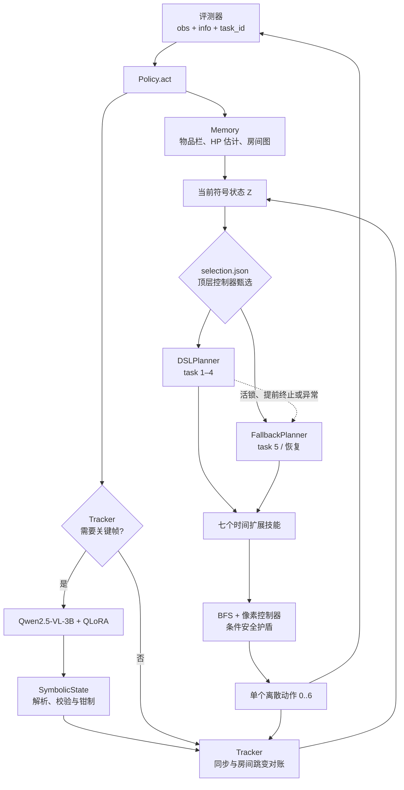
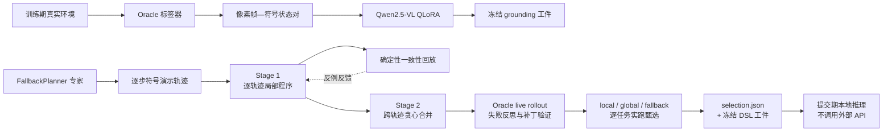
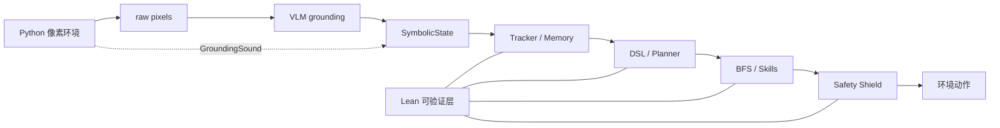

# NesyLink 神经符号 Agent 实验报告

**方法框架**：迁移论文 *"Lifting Traces to Logic: Programmatic Skill Induction with
Neuro-Symbolic Learning for Long-Horizon Agentic Tasks"（NSI, arXiv:2605.01293）*
**最新结果**：提交形态下 **Task 1–4 全通**；**Task 5 按任务设计不要求成功，仅保留完整运行轨迹**
（raw pixels + 标量 reward 历史 + 显式物品栏）
**代码**：`nsi_agent/` · **入口**：`submission_agent.py`（`Policy` / `make_policy`）· **最新复测日期**：2026-07-16

| 提交信息   | 内容                                                       |
| ------ | -------------------------------------------------------- |
| 课程     | 数理逻辑课程设计                                                 |
| 项目     | NesyLink Mathematical Logic / NSI Agent                  |
| 代码仓库   | `github.com/DragonWarrior215/Mathematical-logic-project` |
| 最终策略入口 | `submission_agent.py`（`Policy` / `make_policy`）          |
| 组员     | **张天佑、李云浩、张妍、黄允辰、马绍钧**                                   |

---

## 0. 摘要与课程要求对应

本项目完成了一条从 raw pixels 到可验证符号执行的神经符号 Agent 管线：视觉模型把图像关键帧 grounding 为 `SymbolicState`，Tracker 在关键帧间维护带不确定性的状态估计，DSLPlanner / FallbackPlanner 选择任务目标，BFS 与七个时间扩展技能输出逐像素动作，Safety Shield 和行为闩锁负责安全过滤与感知纠错。训练期使用 Oracle生成视觉标签和专家轨迹；提交期只使用图像、上一步标量 `last_reward`、显式物品栏与`--task-policy` 绑定后由官方 `safe_info` 提供的 `task_id`，不读取地图、坐标、事件、reward 明细、实体或机关真值，也不调用外部 LLM。

课程四项评分要求与本报告证据对应如下：

| 评分模块     | 权重  | 本项目完成内容                                                  | 报告证据             |
| -------- | ---:| -------------------------------------------------------- | ---------------- |
| 环境形式化    | 30% | Lean 建模位置、动作、房间、对象、机关、战斗、陷阱、出口与任务完成语义                    | §11.1–§11.4      |
| 策略形式化与证明 | 30% | Tracker、格子/房间 BFS、Safety Shield、技能契约、Planner、DSL 与组合执行定理 | §11.5–§11.7      |
| 策略性能     | 30% | 统一提交入口完成 Task 1–4；Task 5 保留设计不可成功的完整轨迹与里程碑               | §8–§10           |
| 报告与可读性   | 10% | 方法、输入边界、训练方式、实验协议、抽象假设、复现命令与交付索引齐全                       | 全文，重点 §8、§12–§14 |

### 0.1 核心交付物

| 交付物            | 位置                                  | 状态                                                        |
| -------------- | ----------------------------------- | --------------------------------------------------------- |
| 项目报告           | `REPORT.md`                         | 本文                                                        |
| 最终 Agent 与黑盒入口 | `nsi_agent/`, `submission_agent.py` | 已实现                                                       |
| 冻结 NSI 程序      | `nsi_agent/induction/artifacts/`    | 12 个 JSON（含 `selection.json`）                             |
| Lean 源码        | `lean/NesyFormalization/`           | 23 个 `.lean` 文件，含 `TheoremList.lean` 聚合入口                 |
| Lean 工具链       | `lean/lean-toolchain`               | 固定 Lean 4.29.0                                            |
| 感知模型权重         | QLoRA v4b adapter / 合并模型            | 已下载至忽略目录 `models/grounding-v4b/`；提交 zip 必须附带或提供稳定获取方式与校验值 |
| 运行证据           | `evidence/final/`                   | 含五任务 JSON/日志、环境、哈希、编译与单测记录                                |

---

## 目录

0. [摘要与课程要求对应](#0-摘要与课程要求对应)
1. [系统架构总览](#1-系统架构总览)
2. [感知层 φ：稀疏关键帧 + 符号推演](#2-感知层-φ稀疏关键帧--符号推演)
3. [符号状态 Z 与跨房间记忆](#3-符号状态-z-与跨房间记忆)
4. [执行图 G 与解释器](#4-执行图-g-与解释器)
5. [原语技能层](#5-原语技能层)
6. [顶层规划 I：手写修正规划器](#6-顶层规划-i手写修正规划器)
7. [顶层规划 II：NSI 技能归纳管线](#7-顶层规划-iinsi-技能归纳管线)
8. [测评合规性](#8-测评合规性)
9. [成绩单](#9-成绩单)
10. [关键技术发现](#10-关键技术发现)
11. [Lean 形式化对接点](#11-lean-形式化对接点)
12. [复现命令](#12-复现命令)
13. [关键源码与交付物索引](#13-关键源码与交付物索引)
14. [提交真实性、限制与结论](#14-提交真实性限制与结论)

---

## 1. 系统架构总览

### 1.1 NSI 三元组与本项目的对应

NSI论文中把"技能"定义为三元组 **π = (θ, φ, G)**：θ 为调用参数，φ 为神经感知grounding（原始观测 → 符号谓词），G 为带条件分支/循环/变量绑定的一阶逻辑
**符号执行图**，按 **Perceive → Think → Act** 循环执行；顶层技能程序由"轨迹 $\to$ 逻辑"归纳获得，失败时经符号诊断反思修复。本项目将该框架完整迁移到NesyLink：

| NSI 概念                | 本实现                                                       | 代码位置                                       |
| ----------------------- | ------------------------------------------------------------ | ---------------------------------------------- |
| φ 神经 grounding        | Qwen2.5-VL-3B + QLoRA，像素帧 $\to$ 紧凑符号状态文本         | `grounding/vlm.py`, `grounding/train_qlora.py` |
| 符号状态 Z              | `SymbolicState`（10×8 网格 + 像素级实体）+ 跨房间记忆        | `grounding/schema.py`, `memory.py`             |
| Perceive–Think–Act 循环 | 关键帧调用 VLM + 帧间形式化转移模型死推演                    | `tracker.py`, `agent.py`                       |
| 执行图 G                | DataOp / CheckOp / PrimitiveOp / SkillOp / TerminalOp 图解释器 | `graph.py`                                     |
| 原语技能 $\pi_i$        | goto / open_chest / kill_monster / press_button / toggle_switch / use_exit / wait | `skills.py`                                    |
| 顶层程序（手写基线）    | 9 级优先级修正规划器 + 反思恢复                              | `planner.py`                                   |
| 归纳 Stage 1            | GPT-4o 逐轨迹合成局部专家程序，反例驱动迭代精化              | `induction/synthesize.py`                      |
| 归纳 Stage 2            | 四算子（条件分支/模块移植/变量提升/循环折叠）贪心合并        | `induction/consolidate.py`                     |
| 在线/离线反思           | 运行时活锁 $\to$ 修正规划器接管；离线失败 $\to$ GPT-4o 嫁接恢复分支 | `induction/dsl.py`, `induction/reflect.py`     |

### 1.2 关键环境约束

引擎公开接口（`constants.py`，刻意与环境内部解耦复制一份）：

- **1 env.step = 1 像素**位移，单局最多约 2000 步 → 逐步调用 3B VLM 完全不可行；
- 地图为 **10×8 网格 × 16px tile = 160×128px**；玩家/怪物是 16×16 的**像素级精确实体**，不占格；
- 玩家 1px/步，怪物 0.5px/步，命中怪物眩晕 60 tick，玩家满血 5HP；
- 出口固定在边界格：`N:(4,0),(5,0) S:(4,7),(5,7) W:(0,3),(0,4) E:(9,3),(9,4)`；
- 动作空间 7 个：`WAIT / UP / DOWN / LEFT / RIGHT / A(交互·挥剑) / B(盾)`。

### 1.3 五项任务与成功判据

项目统一采用 `observation_mode="pixels"`；成功以评测器返回任务完成为准，达到`max_steps` 但未完成记为截断失败。五个任务逐步增加战斗、跨房路由、动态机关与资源预算约束：

| 任务     | 默认步数上限 | 目标                      | 主要能力验收              |
| ------ | ------:| ----------------------- | ------------------- |
| task_1 | 500    | 取得钥匙并从北侧锁门离开            | 像素定位、开箱、开锁与出口对账     |
| task_2 | 500    | 击败怪物、取得钥匙并通过西侧条件门       | 战斗、条件门与反应式中断        |
| task_3 | 1500   | 穿过怪物房取钥匙，返回起点并打开东侧锁门    | 跨房记忆、往返路由与长程技能组合    |
| task_4 | 2000   | 操作旋桥，取得钥匙和剑，击败怪物并打开最终宝箱 | 动态机关、不可见门、行为闩锁与恢复规划 |
| task_5 | 2000   | 探索多房间地牢并打开全部宝箱          | 全局探索、生命/时间预算与资源阶段机  |

### 1.4 分层数据流



### 1.5 模块边界

| 模块                              | 核心责任                           | 明确不承担的责任      |
| ------------------------------- | ------------------------------ | ------------- |
| `agent.py`                      | 生命周期、Perceive–Think–Act 编排、总兜底 | 不包含具体任务策略     |
| `grounding/`                    | 像素到符号状态、数据生成、训练和评估             | 不决定动作         |
| `grounding/schema.py`           | 符号状态类型、文本协议与基本谓词               | 不保存跨房历史       |
| `memory.py`                     | 跨步/跨房状态、行为闩锁、物品栏与 HP 估计        | 不执行路径搜索       |
| `tracker.py`                    | 关键帧调度、运动预测、房间跳变与怪物不确定性         | 不选择任务目标       |
| `graph.py` / `induction/dsl.py` | 图解释器、DSL 校验编译、运行与恢复            | 不训练 VLM       |
| `skills.py`                     | BFS 导航、交互、过门、战斗与动作护盾           | 不决定全局任务顺序     |
| `planner.py`                    | 手写目标仲裁、跨房路由与 task_5 资源规划       | 不直接实现像素移动     |
| `induction/*.py`                | 录制、合成、合并、反思和甄选                 | 最终推理不调用外部 LLM |
| `induction/artifacts/`          | 冻结程序与运行时选择配置                   | 不包含 VLM 权重    |

### 1.6 主控制回路（`agent.py::Policy.act`）

每个 env.step 精确执行以下逻辑（一步只产出一个动作）：

```python
def act(self, obs, info):
    self.memory.on_step(info)                 # 仅读 inventory 视图 + 步数
    if self._blocked_by_reward(info):         # reward 反馈：上一步撞墙？
        self.tracker.note_blocked_feedback()  # 回滚 1 步乐观预测

    if self.tracker.should_perceive() and backoff<=0:
        try:  state = self.backend.ground(obs)   # φ：像素 → 谓词
        except: self._ground_backoff = 3         # grounding 崩了绝不炸测评器
        if state: self.tracker.sync(state)        # 与预测对账、登记穿房

    try:  action = self.planner.step(self.ctx)    # G：符号执行
    except: action = 0                            # 最后兜底 WAIT
    self.tracker.apply_action(action)             # 形式化转移模型死推演
    return int(action)
```

三处"异常免疫"是提交形态稳健的关键：grounding 失败退避重试（下一帧通常自愈）、规划器异常兜底 WAIT、感知解析失败在 `ground()` 内先降温采样重试一次。

---

## 2. 感知层 φ：稀疏关键帧 + 符号推演

核心思想：VLM 只在**关键帧**被调用，帧间玩家位置用基于当前符号地图的**确定性预测函数**做 dead-reckoning，并利用 reward 反馈修正未知碰撞造成的预测
误差；怪物位置则膨胀成**不确定区域**，由安全护盾拦截符号上不安全的移动。这样把每局约 2000 次潜在 VLM 调用压到几十~上百次。

### 2.1 关键帧调度（`tracker.py::should_perceive`）

在以下任一条件触发一次 grounding，否则纯靠推演：

- **显式请求** `perceive_requested`（交互/挥剑后必查；护盾停滞时；开箱前对齐时）；
- **期待穿房** `expect_transition`（UseExit 推门后必须核实是否真的过去了）；
- **周期到点**：平时 `SYNC_INTERVAL_CALM = 24` 步一次；**危险临近**（任一怪物切比雪夫距离 ≤ `DANGER_RADIUS_PX = 3.5×tile = 56px`）时收紧到`SYNC_INTERVAL_DANGER = 8` 步一次；战斗技能内部进一步收紧到每 6 步。

### 2.2 符号运动预测模型（`tracker.py::apply_action / _predict_move`）

发出动作后立即前推预测位置。该模型复现已知符号地图上的轴向移动、边界钳制与16×16 矩形占格规则，是对环境碰撞语义的**符号近似**：

```
_predict_move(px, dir):
    nx, ny = clamp(px + 单位向量, [0, MAP−tile])   # 先按 1px 前移并夹在地图内
    if _rect_hits_block(nx, ny): return px          # 16×16 rect 覆盖的任一格
    return (nx, ny)                                  # 是已知阻挡则原地不动
```

`_rect_hits_block` 遍历玩家矩形覆盖的所有格（`floor` 除法 + 右下角 −1px 判边界），查 `memory.is_blocking`。A/B 交互动作会置 `perceive_requested`（世界可能变化，下一步必须核实）。

### 2.3 怪物不确定球 + 安全护盾（`tracker.py` + `skills.py::shielded`）

- 每一步所有怪物 `uncertainty_px += MONSTER_SPEED_PX = 0.5`：自上次感知起，怪物真实位置一定落在以其上次观测中心为心、半径 = 已推演步数 × 0.5px 的球内；
- `monster_clearance_px(left, top)`：玩家矩形与"膨胀后怪物矩形"的最小切比雪夫间隙（`reach = tile + uncertainty`），负值即重叠；
- `px_is_safe(margin = CONTACT_MARGIN_PX = 6px)` 为安全判据；
- **护盾** `shielded(action)`：任何会把玩家推入不确定球的移动都被否决，转而`request_perceive()`（让球坍缩回真实点）并出盾（有盾）或 WAIT。

> 这是稀疏感知下建立**条件安全性**的核心：在 grounding 未漏检怪物、0.5px/步速度上界成立且 Tracker 危险区域持续覆盖真实怪物位置的前提下，护盾放行的移动不会进入符号危险区域。它不是像素环境中“绝不受伤”的无条件保证（见 §11）。

### 2.4 reward 作反馈：撞墙检测与回滚（`agent.py::_blocked_by_reward`）

作业允许把 env 的 **reward 作历史反馈信号**。撞墙步会在普通 step 惩罚之上叠加`invalid_action` 惩罚，新版官方 `safe_info` 中的标量可直接辨识：

```
last_reward = -0.01 + (-0.05) = -0.06
撞墙 ⟺ |last_reward + 0.06| < 1e-6
```

代码仍兼容旧调试接口中的 `reward_signals/reward_weights`，但 2026-07-16最终复测使用 `--info-mode safe`，在线决策不依赖这些明细。

检出后 `note_blocked_feedback()` 把上一步乐观预测的位置回滚到 `_prev_px`（**1 步延迟**的撞墙反馈），并置 `last_move_blocked`。这条链条让我们**不必** 从"预测与观测偏差"去反推墙体——那会导致"幽灵墙自增强"（见 §10-5）。

### 2.5 关键帧对账与房间里程计（`tracker.py::sync`）

`sync(state)` 把新 grounding 快照与预测对账，核心是**判定是否发生了穿房**，用两条独立证据抗噪：

1. **像素跳变**：`|Δx|` 或 `|Δy| > 2×tile`；
2. **网格整体替换**：新旧网格逐格不同数 `≥ 12`（穿房换了整张图）。

三种情形：

- **有 `expect_transition`（主动推门）**：跳变则 `memory.transition(dir, state)`按里程计更新房间坐标；否则记一次 `failed_exits[dir] += 1` 并当作同房刷新；
- **无 expect 但检测到瞬移**：引擎会在玩家"贴合出口格"的**瞬间**传送，这可能发生在 GoTo 的对齐阶段、早于 UseExit 置标志位。此时用"网格大换 ∨ 落点在
  移动方向**对侧**边界（进房出生点，`margin = 3×tile`）"判定这是一次穿房，用**最后移动方向**登记 `crossed`——否则外房关键帧会静默覆盖当前房记忆、腐蚀里程计（这是攻克 task_4 的竞态修复之一，见 §10-1）；
- **普通刷新**：`integrate_keyframe(state)` 就地并入当前房。

### 2.6 VLM grounding 模型（`grounding/vlm.py`）

- 基座 **Qwen2.5-VL-3B-Instruct**，4bit NF4 加载（`NSI_VLM_4BIT=1` 默认）+ 可选 LoRA adapter（`NSI_VLM_ADAPTER`），推理 `max_new_tokens=220`、贪心解码；
  
- 输出即 `SymbolicState.to_text()` 的紧凑格式（约 150 token）：

  ```
  GRID
  ##########
  ..........          (8 行 × 10 字符，row0=顶)
  ...
  PLAYER 64,96 up
  MONSTERS chaser:32,32 patroller:96,80
  EXITS N:- S:normal W:locked E:-
  ```

- **解析容错**（`schema.py::from_text`）：正则抽取玩家/怪物/出口，坐标夹到合法范围；网格行只保留合法 tile 字符，长度漂移则按 `GRID_W` 裁剪/补齐（均匀行如被 LM 缩写的 `======` 用自身字符补齐）；
  
- **解析校验 + 采样重试**（`ground()`）：贪心结果解析失败则以 `temperature=0.3`再采一次——把偶发格式错误压到接近 0。

### 2.7 QLoRA 训练与数据配方（`grounding/train_qlora.py`, `grounding/prompts.py`）

**patch–tile 精确对齐**（最关键的归纳偏置）：帧用最近邻放大 `IMAGE_SCALE=3.5`（160×128 → 560×448），使 Qwen2.5-VL 的 **28px 合并 patch 恰好覆盖 16px 游戏tile 的 2×2**——每个 tile 对应 2×2 视觉 token，天然利于逐格分类。

**训练设置**：

| 项    | 值                                                               |
| ---- | --------------------------------------------------------------- |
| LoRA | rank 16, α 32, dropout 0.05, target = q/k/v/o/gate/up/down_proj |
| 量化   | 4bit NF4 + double-quant，compute dtype bf16                      |
| 优化   | lr 1e-4 cosine，warmup 0.03，2 epoch，batch 4 × grad-accum 4，梯度检查点 |
| 监督   | **只在答案上算 loss**                                                 |

**collator 掩码 bug（v1→v2 的关键修复）**：只训练答案需把 prompt 部分掩成`IGNORE_INDEX`，但 prompt 长度**必须在"处理后 ids"上量**——processor 会把图像占位符展开成大量视觉 token，若用原始 tokenizer 长度会把掩码切得太早、标签严重错位（v1 因此 24% 格式失败）。修复：对每条样本单独跑一遍`processor(text=[prompt], images=[image])` 取真实 prompt 长度再掩码。

**数据配方（v2→v3 的质变）**：v1/v2 用约 150 张地图 × 多样本，模型学会**背布局**（分布内 100%、未见布局整格全对 0%）；v3 改为 **3000 个"单次使用"独立布局 × 每张仅 3 样本**（外加 1503 个深渊房样本续训成 v3b），强迫模型真正读图——未见布局整格全对从 0% 升到 95.5%。训练标签由环境的 Oracle 后端自动生成（训练期允许用 info）。

**v3b→v4：标签卫生 + 状态翻转（`grounding/dataset_v4.py`）**。v3b 的持续性误感知（开门后仍读 locked、深渊房幻影出口）溯源到**标签污染**：深渊房补充
样本 94%（v3 全集 10.3%）生成于 oracle 可见性修复之前——深渊压门（门格双 A）仍标注门状态，等于教模型"隔深渊猜门"。修复为纯文本重标（"两门格均 A"与oracle covered 判定实测逐字等价），另补三类新样本：① 翻转变体房（锁门`opened` 突变前/后成对帧，传送避开门格防玩家精灵遮挡监督）；② 深渊门矩阵（可见性对齐重制 + 开锁态/半覆盖组合）；③ 课程图突变清扫（oracle 策略途中就地翻转门/箱/杆/桥采样后精确还原，断言校验）。重标 v3(14056) + 重标深渊(1895) + 新增 4154，从头重训 2 epoch。

**v4→v4b：破除课程房记忆先验**。task4_object_shift 变体诊断发现：模型在未见布局上真读图（96.6%），但在**高度熟悉的课程房间里按记忆模板转写**——
task_4 北房钥匙箱除原位外 7 个移位位置全部单行错位一格。修复为课程图物件域随机化：11 个课程房间的箱/杆/钮洗到随机地板位 × 32 组（1096 样本，跨房
effect 的房间走运行时突变），+3400 v4 重放续训——位置扫描 8/8 全对，object_shift 变体从 2000 截断转 1677 通关。

---

## 3. 符号状态 Z 与跨房间记忆

### 3.1 `SymbolicState`（`grounding/schema.py`）

一房间的符号快照 = **静态网格 + 像素级动态实体**：

- `grid`：8×10 字符，17 类 tile。`.`floor `#`wall；宝箱按内容物细分`K`钥匙 `G`金币 `H`回血 `S`道具/剑 `C`未知 `O`已开；`T`尖刺 `A`深渊 `_`gap`=`桥 `b/B`按钮(未压/已压) `L/l`拉杆(闲置/激活) `N`NPC；
- `player_px / facing`、`monsters(kind,px)`、`exits{dir: state}`（state ∈ `- / normal / locked / conditional / open`）；
- 派生谓词：`is_blocking`（`BLOCKING_TILES` = 墙/NPC/gap/所有宝箱）、`is_hazard`（`HAZARD_TILES` = 尖刺/深渊）、`closed_chests()`、`tiles_of(cls...)`、`player_tile`（中心取整归格）。这些纯函数是符号层与 Lean 的接口。

### 3.2 跨房间记忆（`memory.py`）

**房间里程计图**：起始房坐标 `(0,0)`，沿方向 d 穿门坐标偏移 `EXIT_DELTA[d]`——**不需要地图真值，只靠 agent 自身穿房历史**。每房 `RoomMemory` 存：

- `state`：最近一次 grounding 快照；
- `learned_blocked{tile: 过期步}`：碰撞学到的隐藏墙，`TTL=300` 步过期；感知能分类的格由感知覆盖猜测，只保留"感知仍称 floor"的学习块（标记 grounding 错误）；
- `visited_exits / probed_dirs / failed_exits`：穿过的门 / 盲探过的方向 / 失败计数；
- `opened_exits`：**引擎确认已消耗的锁**（`locked_exit` 目标实跑成功时写入；无 TTL——锁消耗不可逆，与 `learned_blocked` 的暂态假设相反，见 §6.1）；
- `opened_chests / talked_npcs / switch_toggles`：交互进度。

`is_blocking(x,y)` 融合"未过期学习块 ∨ 感知阻挡"。`InventoryView` 只封装测评接口显式提供的物品栏（keys/gold/items/tools/equipped + `has_sword/has_shield`派生）。旧调试接口中 `hp_estimate` 可从 `hp_loss/agent_healed` 明细对账；最终 `safe` 模式不提供这些事件，因此实际评测使用 NesyLink 上游的**200 步扣血周期**作保守 tick 退化模型，不声称能观测隐藏 HP 真值。

---

## 4. 执行图 G 与解释器（`graph.py`）

技能/程序 = 共享作用域 C（变量）与符号状态 Z 上的**类型化节点图**，节点种类严格对齐论文：

| 节点            | 语义                                             |
| ------------- | ---------------------------------------------- |
| `DataOp`      | 从状态绑定/更新作用域变量，`→ next`                         |
| `CheckOp`     | 求谓词并分支 `on_true/on_false`（**循环 = 带回边的 Check**） |
| `PrimitiveOp` | 产出一个 env 动作，`→ next`                           |
| `SkillOp`     | 调用子技能（时间扩展，运行到返回）`on_success/on_fail`          |
| `TerminalOp`  | 终止，带 success + **符号诊断项** diagnosis             |

`Interpreter` 是**可续算**的：每次 `step` 推进图直到恰好产出一个动作或终止，给定`(program, scope, state)` **完全确定**。

防非产出循环：单步内最多推进`MAX_TRANSITIONS_PER_STEP=256` 次转移，超出判 `nonproductive_loop` 失败。`SkillProgram.__post_init__` 静态校验所有边指向存在的节点`complexity()=len(nodes)`是归纳目标里的 MDL 项 |π| 之一。这一层正是可在 Lean 中建模为小步转移语义的部分。

---

## 5. 原语技能层（`skills.py`）

所有导航技能遵循同一模式：**每步在 10×8 记忆网格上重跑 tile 级 BFS**（网格小，重规划极廉价）→ 像素控制器驱动（1px/步）→ 安全护盾把关。

**公共构件**：

- `bfs_path(start, goals, avoid_monsters, allow_hazard)`：默认避开`monster_blocked_tiles`（中心落入不确定球的格），找不到路则退避为`avoid_monsters=False` 再试一次（护盾仍逐步把关），仍无则报符号失败 `no_path`；
- `move_toward_waypoint`：**先对齐误差较小（通常是垂直）的轴**，使 16×16 玩家矩形不会斜切入非路径格；
- `disambiguation_nudge`：grounded 坐标取整、引擎保留分数 → tile 归属在边界±1px 内不可信。任何"依赖格归属"的交互前，先向当前格内部挪到两轴都 ≥2px 明确；
- `shielded`：见 §2.3。

**七个技能**（`SKILL_REGISTRY`）：

| 技能             | 关键机制                                                                                                                   |
| -------------- | ---------------------------------------------------------------------------------------------------------------------- |
| `GoToTile`     | 导航到目标格（或其邻格）。**停滞检测**：连续 ≥4 次移动但两次关键帧间实位未动 → 该格实为隐藏墙，`mark_blocked` 后让 BFS 绕行。**撞墙检测**：`last_move_blocked` 连续 ≥4 次同理标记 |
| `OpenChest`    | 走到邻格 → `disambiguation_nudge` → **仅在刚同步的步**按 A（引擎按真实位置判邻接，在陈旧预测上按 A 会误挥剑）→ 按 A ≤4 次，验证变 `O`                            |
| `PressButton`  | 站上按钮格（按钮按位置触发），验证变 `B`                                                                                                 |
| `ToggleSwitch` | 走到拉杆邻格按 A 一次。杆效果常在**另一房**（旋桥），无法就地验证 → 交互后由规划器重感知受影响房并重查可达性                                                            |
| `UseExit`      | 走到出口格 → **精确像素对齐** → 向边界外推。用 `expect_transition` + `last_transition_result` 与 tracker 对账；`≥2` 次推不动判 `exit_blocked`     |
| `KillMonster`  | 见下                                                                                                                     |
| `Wait`         | 空转 N 步（周期重感知）                                                                                                          |

**`KillMonster` 战术**（步数减半的关键）：

- 选最近怪（切比雪夫），按 `_swing_facing` 判断剑击窗口：垂直偏移 ≤10px 且水平 `gap ∈ [4,30]px` 即可朝该向挥剑——**下界 4 很小是刻意的**：引擎先结算剑、命中即眩晕怪 60 tick，故"贴身挥剑"安全（见 §10-6）；
- 命中后置 `_stun_left≈55`，利用眩晕窗口追击连击；未对齐且接触在即则出盾；
- 贪心逼近走进墙/箱时，**提交一段 BFS 绕行**（`_detour_left=10`），避免贪心与BFS 两个控制器互相抖动（一次只给一个权威）。

---

## 6. 顶层规划 I：手写修正规划器（`planner.py::FallbackPlanner`）

开发基线、归纳程序的安全网，也是 task_5 的最终选择。它是一个**9 级优先级条件级联**（`_choose_goal`），每个 env.step 选一个 Goal 并驱动对应技能；失败的 Goal获得**符号诊断 + 冷却**（`FAIL_COOLDOWN_STEPS=120`），相关状态变化后再重试。

```
0. 无剑且受威胁（间隙 <2 tile）→ 逃向最远安全格
1. 有剑且怪逼近（<1.9 tile）或怪挡住通往待办的所有路 → kill_monster
1.5 已提交的拨杆意图（连通性反思恢复）→ 去拨杆
2. 开最近可达的关闭宝箱
3. 持钥匙 + 锁门 → use_exit（goal key 含钥匙数，加钥匙即重试）
4. 按下未压按钮（廉价，且多数条件门的前置）
5. 在"未试过的条件签名"下试条件门（签名=钥匙数×怪数×已压按钮集）
6. unblock：本房待办不可达但存在已知拨杆 → 去拨杆（意图跨房持久化）
7. 路由：向"有待办/前沿出口"的最近房前进（房图 BFS 求首跳 `_first_hop`）
7.5 局部盲探：感知可能漏门（深渊背景）→ 向"出口格看着能走"的未试方向推一下，
    引擎权威裁决（穿房 or 挡住）
7.6 危险覆盖的边界方向可能藏被覆盖门 → 拨杆改旋桥再暴露出来探
7.7 弱待办路由：向"仍有未探方向"的房前进
8. 空转等待（周期重感知，兼冷却过期后重试）
```

**反思恢复**内嵌其中：可达性失败（`no_path/unreachable`）且已知存在拨杆 $\to$ 置 `pending_toggle`，先去翻一个杆再重试（`MAX_TOGGLES=12` 上限）；拨杆成功后清空冷却让"曾不可达"的目标立即重试。**战斗中断**：有剑且非战斗 Goal 时若怪间隙 < `THREAT_CLEARANCE_PX=12`，放弃当前 Goal 转战斗。方向偏好 `TASK_DIR_HINTS` 是 **纯提示**（仅影响探索顺序），逻辑本身任务无关。

### 6.1 行为对账兜底：引擎确认的事实压过持续性误感知（`opened_exits`）

**动机（task_4 VLM 步数膨胀 1483→1911 的根治）**：VLM 会把**已开的门持续误读**为 locked/conditional——这是模型级误分类，重新感知无效。误读经由级联的第 3/5/6 级放大成"幻影连通性错误"：开锁目标瞬间失败 → 反思恢复去拨杆 → 回来还是"locked" → 再拨……每圈 ~250 步的拨杆乒乓（诊断见 goal_log：同一 (1,0) east 在door_opened 之后仍反复生成 `locked_exit`/`cond_exit` 目标）。

**写入路径**（`planner.py::_on_success`）——唯一且权威：

```python
if goal.key[0] == "locked_exit":       # use_exit 仅在房间传送真实发生时返回 ok
    room = ctx.memory.rooms.get(tuple(coord))
    if room is not None:
        room.opened_exits.add(direction)   # 引擎权威答复：这把锁已消耗
```

只依赖 agent 自身动作的结果（穿房事实），不依赖任何感知分类，合规性与`_blocked_by_reward` 同源。

**读取路径**——八处消费点覆盖目标生成、pending 判定与评分，使幻影锁在整个级联中"不可见"：

| 消费点                                      | 作用                                     |
| ---------------------------------------- | -------------------------------------- |
| `_locked_exit_goal`                      | 不再为已开方向生成开锁目标                          |
| `_conditional_exit_goal`                 | 感知在 locked/conditional 间摇摆时同样跳过        |
| `_pending_in_room`                       | "锁门+持钥匙"不再算该房待办 → 房间不因幻影锁保持 pending    |
| `_unblock_goal.exit_pending`             | 已开的门不能触发拨杆恢复（乒乓循环的闸门）                  |
| `_task5_global_goal`                     | 全局评分器的锁门候选（-500 档）跳过已开方向               |
| `_task5_room_score` / `_room_work_score` | "持钥匙时锁门房值得去"加分只数未开的锁                   |
| `_local_exit_score`                      | 误读 locked 的已开门按 open 打分（5），而非 -100/950 |
| `_route_goal` frontier                   | 0 钥匙时误读 locked 的已开门仍可通行（不被自己的正确知识困住）   |

**设计脉络**：这是"感知提出假设、引擎行为裁决事实"家族的第 4 个成员——① 撞墙 reward 检测（§2.4，暂态、带回滚）；② 盲探针 `probed_dirs`（§10-1，
不可见门的存在性裁决）；③ HP 记账 reward 信号（§3.2）；④ `opened_exits`（本节，**不可逆事实故无 TTL**）。

**实测与代价**：task_4 VLM 1911→**1581**（距 2000 上限余量 89→419，恢复模式 goal_log 53→35 条）；oracle 代价 +160（1321→1481）——旧高效路径依赖已开门的陈旧 "locked+key" pending 充当回到 (1,0) 的**偶然路标**，把事实显式化后失去该诱饵，这一隐藏耦合随修复被显式记录。对照实验：task_4 纯修正规划器 VLM 下2000 步截断失败，确认"归纳程序开局 + 修正规划器收尾"混合为最优配置。此方案**不修复感知本身**（治本需 v4 重训补开门后状态样本），是符号层承认"感知会持续犯错"后的架构性兜底。

---

## 7. 顶层规划 II：NSI 技能归纳管线（`induction/`）

把专家演示轨迹"提升为逻辑"：GPT-4o 写 DSL 程序，**确定性回放一致性**作接受判据，两阶段合成 + 离线/在线反思修复。



### 7.1 DSL 与沙箱表达式（`induction/dsl.py`）

程序是 JSON：`{name, entry, reactive[], nodes[]}`。节点 4 种（data/check/skill/terminal），循环 = 带回边的 check，`reactive` 守卫每步优先于图求值（用于战斗中断）。表达式是**受限、无副作用的 Python 子集**，对符号状态求值：

- `_validate` 白名单 AST：只允许布尔/比较/算术/调用/下标/属性/三元；属性访问仅限 `inv.` / `var.`；调用只能是命名函数；
- `build_env` 暴露纯查询命名空间：`closed_chests() chests(kind) nearest(tiles) reachable(tile) exit_state(dir) visited(dir) threatened() buttons() switches() room_known(dir) hop_toward(kind) player_tile()` 等 + `inv.*`；
- **`hop_toward('locked_exit'|'chest'|'switch'|'unexplored')`**：在已知房图上BFS，返回通往"最近满足条件之房"的**首跳方向**——多房任务的核心查询（如`use_exit(hop_toward('locked_exit'))` 携钥匙回门）。加入它后 task_4 覆盖率从 58.5% → 87.1%；
- `eval` 在 `{"__builtins__": {}}` + 受限命名空间中执行，裸名回退到作用域变量（LLM 常丢 `var.` 前缀）。`complexity(spec)` = 节点/守卫计数 + 每个表达式的 token 成本，即 MDL |π|。

### 7.2 经验程序一致性（`induction/consistency.py`）

**确定性、不含 LLM 的接受判据**。`replay(spec, trace)`：把录制的每步符号状态喂给程序，要求它复现专家动作；`matched` 计入覆盖 |R̂|；一次发散后程序**重对齐** （新实例）以便后段仍能得分（近似论文的"一致性区域大小"）。归纳目标：
$$
\max_{\pi} \sum_{\text{traces}} |\hat{R}(\pi)| - \lambda \cdot |\pi| \quad (\lambda = \text{LAMBDA} = 0.5)
$$
`score()` 返回目标值 + 每轨迹结果；发散点记录 `(step, 期望vs实际动作, 坐标, 状态文本, 出错节点)` 作为反例喂回 LLM。

### 7.3 Stage 1 逐轨迹合成（`induction/synthesize.py`）

对每条演示轨迹合成一个"局部专家"程序：`summarize_trace` 把轨迹压成**决策段落**（技能调用序列 + 事件 + 物品栏），GPT-4o 结构化输出（`PROGRAM_JSON_SCHEMA`）；最多 4 轮**反例驱动精化**——回放找首个未覆盖状态 → `divergence_feedback` 指出"在节点 X 处专家做 A 而你选了 B"（含程序过早终止的提示）→ 修订；覆盖 ≥98% 且无发散即停。`DSL_GUIDE` 系统提示详列 DSL 文法、技能签名、查询命名空间与"泛化而非
背坐标/步数"的规则。

当前冻结的五条成功演示轨迹长度分别为 **279 / 197 / 582 / 1229 / 1069** 步；轨迹保存动作前符号状态、物品栏、专家动作、当前技能及环境事件，既供合成也供确定性回放审计。

### 7.4 Stage 2 跨轨迹合并（`induction/consolidate.py`）

贪心合并局部专家为**一个全局程序**。用覆盖最广者初始化，每轮对**最难轨迹**（覆盖最低）用论文四算子合并：**条件分支 / 模块移植（子图搬运+重绑参数）/
变量提升（常量→状态查询）/ 循环折叠**；候选**当且仅当总覆盖严格增加且不回退任何已覆盖轨迹**`matched` 掉 >10 视为回退）才接受，每次合并最多 3 轮。最终全局程序 `mathematical_logic_task_2`（7 节点 + 1 守卫）源自 task_2 局部专家的自然泛化——**一套程序覆盖全部 5 条演示轨迹（90–99.6%）**；未被全局充分覆盖（<0.9）的轨迹保留其专家工件。

### 7.5 DSLPlanner 运行时 + 在线反思恢复（`induction/dsl.py::DSLPlanner`）

执行归纳工件，并内建**运行时反思恢复**（论文"失败→恢复→嫁接"的在线对应）：

- **反应守卫**先于图：每步扫 `reactive`，命中即抢占为一次技能调用；
- **活锁检测**：`_progress_marker` 只取**单调进展量**（钥匙/金币/工具/已知房数/剩余宝箱/剩余怪/已压按钮）——房间来回振荡**不**重置活锁钟。`LIVELOCK_STEPS=150`步无进展判活锁；**血量吃紧（hp≤3）时收紧到 80 步**（task_5 扣血下停滞是致命的）；
- **恢复**：启动 `FallbackPlanner` 并设置 `RECOVERY_MAX_STEPS=500` 的恢复窗口；但当前 `MAX_RECOVERIES=1` 使第一次恢复立即满足 permanent 条件，因此现行配置中修正规划器会从第一次恢复起长期持有控制权，而不会再交回归纳程序；
- **"程序自认为完成但 episode 未结束"** → 立即判为覆盖缺口、交修正规划器（不空转）；
- **异常免疫**：坏表达式在活 episode 中不炸，转为程序失败诊断。

### 7.6 离线反思嫁接（`induction/reflect.py`）

开发期在**真环境**跑归纳程序；失败时把终止诊断 + 尾部决策上下文交 GPT-4o，**嫁接一条恢复分支**。补丁仅当 (a) 演示轨迹一致性覆盖不下降（`value ≥ baseline−25`）且 (b) 原先失败的任务在**实跑（oracle 后端）中现在通关**才保留——一致性防回归、实跑验闭环，两道关缺一不可（见 §10-2）。

### 7.7 实跑甄选（`induction/select.py` → `selection.json`）

对每关把三种候选（per-task 局部专家 / 全局程序 / 手写修正规划器）**逐一实跑**，第一个通关者写入 `selection.json`，运行时加载器严格遵从——**上线配置即验证批准的配置**。当前甄选结果：

| 任务     | 采用          | 工件                                           |
| ------ | ----------- | -------------------------------------------- |
| task_1 | 局部归纳程序      | `mathematical_logic_task_1.json`（8 节点）       |
| task_2 | 局部归纳程序      | `mathematical_logic_task_2.json`（7 节点，1 守卫）  |
| task_3 | 局部归纳程序      | `mathematical_logic_task_3.json`（13 节点，1 守卫） |
| task_4 | 局部归纳程序      | `mathematical_logic_task_4.json`（14 节点）      |
| task_5 | **手写修正规划器** | `null`（隐藏扣血预算极紧，归纳程序余量不足）                    |

---

## 8. 测评合规性

### 8.1 在线输入输出契约

| 通道                    | 在线用途                     | 合规边界                                |
| --------------------- | ------------------------ | ----------------------------------- |
| `obs`                 | VLM grounding 的唯一世界视觉来源  | 仅使用 160×128 raw pixels              |
| `info["inventory"]`   | 钥匙、金币、工具和装备槽             | 评测接口显式提供                            |
| `info["last_reward"]` | 识别当前规则下 `-0.06` 的纯撞墙反馈   | 仅使用官方 `safe_info` 给出的标量 reward      |
| `info["task_id"]`     | 选择冻结工件、探索提示与 task_5 资源策略 | 仅在显式 `--task-policy` 绑定时提供；不据此读地图真值 |
| 输出                    | 一个 `int` 动作              | 必须属于 `0..6`                         |

动作编号为 `0:WAIT, 1:UP, 2:DOWN, 3:LEFT, 4:RIGHT, 5:BUTTON_A, 6:BUTTON_B`。代码**不读取** `info["agent"]`、房间 ID、真实地图、实体位置、事件、
reward 明细或动态对象真值。NesyLink `036df78` 会无参调用 `reset()`，因此 Agent 在 episode 首步从 `safe_info["task_id"]` 完成任务绑定。`OracleGrounding`（会读引擎内部状态）仅用于训练期标注、轨迹录制、调试和甄选；`make_policy()` 显式拒绝 `NSI_BACKEND=oracle`。归纳产物是冻结的本地 JSON，提交期不调用 GPT-4o 或其他外部 API。

### 8.2 容错与降级矩阵

| 故障            | 检测方式                                       | 在线降级行为                                            |
| ------------- | ------------------------------------------ | ------------------------------------------------- |
| VLM 文本格式错误    | `SymbolicState.from_text` 失败               | 以 `temperature=0.3` 重试一次                          |
| VLM 加载或推理异常   | `Policy` 捕获 grounding 异常                   | 退避 3 步，继续符号预测；无初始状态时 WAIT                         |
| 未知碰撞导致预测错误    | `last_reward=-0.06`（step + invalid action） | 回滚 1px；累积证据后写入 300 步 TTL 阻挡记忆                     |
| 已开门/箱/按钮被视觉误读 | 行为成功与后续视觉冲突                                | `opened_exits/opened_chests/pressed_buttons` 闩锁优先 |
| 出口被遮挡或漏检      | 边界可通但出口状态为 `-`                             | 盲探，让环境以穿房/阻挡结果裁决并记录                               |
| 技能不可达或超时      | 结构化 diagnosis                              | 目标冷却；必要时切换拉杆或重新路由                                 |
| DSL 非产出循环     | 单步 256 次内部转移上限                             | 终止当前程序并给出诊断                                       |
| DSL 活锁或提前完成   | 80/150 步进展计时；episode 仍未结束                  | `FallbackPlanner` 接管                              |
| DSL 表达式异常     | AST 求值或运行时异常                               | 保存 `runtime_error` 并在当前步 WAIT                     |
| 在线工件加载/编译异常   | `load_planner` 包装捕获                        | 回退到 `FallbackPlanner`                             |
| 顶层规划器未知异常     | `Policy.act` 最外层捕获                         | 当前步返回 WAIT，避免中断评测器                                |

这些降级路径并非都能修复根因：持续模型加载失败可能导致长期 WAIT，包装范围外的配置错误也可能在初始化阶段直接暴露。因此“异常免疫”是提交主路径的有界降级，而非对所有部署错误的无条件自愈。

---

## 9. 成绩单

### 9.1 统一测评协议

端到端性能通过课程统一入口复现，评测阶段不训练、不访问 Oracle、不调用外部 API：

```bash
python utils/evaluate_policy.py \
  --tasks mathematical_logic/task_1 mathematical_logic/task_2 \
          mathematical_logic/task_3 mathematical_logic/task_4 \
          mathematical_logic/task_5 \
  --task-policy mathematical_logic/task_1=submission_agent.py \
  --task-policy mathematical_logic/task_2=submission_agent.py \
  --task-policy mathematical_logic/task_3=submission_agent.py \
  --task-policy mathematical_logic/task_4=submission_agent.py \
  --task-policy mathematical_logic/task_5=submission_agent.py \
  --info-mode safe --num-envs 1 --seed 0 \
  --json-out evidence/final/evaluate_5tasks.json
```

| 项目     | 约定                                                     |
| ------ | ------------------------------------------------------ |
| 观测     | `observation_mode="pixels"`，地图区为 128×160 RGB           |
| 在线辅助输入 | 上一步标量 `last_reward`、显式物品栏、专用策略绑定的 `task_id`            |
| 禁止输入   | `info["agent"]`、地图/房间 ID、对象坐标、机关状态和其他内部真值              |
| 成功判定   | `world_completed` / 任务完成终止；到达 `max_steps` 但未完成记为失败     |
| 主要指标   | 成功率、成功轨迹步数、与 Oracle 符号层参照的步数差                          |
| 辅助指标   | grounding 精度、程序一致性覆盖、恢复次数、地图变体成功率                      |
| 最终策略   | Qwen2.5-VL-3B QLoRA v4b + 冻结 `selection.json` 与 DSL 工件 |

基础环境对同一配置表现为确定性，表中“步数”是终测轨迹的环境步数；若提交评测环境引入随机性，应同时报告多次运行的均值、标准差、成功/总次数和 seed 列表，而不能只保留最好一次。

### 9.2 端到端评测（最终，提交形态）

`python utils/evaluate_policy.py --info-mode safe` + 五个显式 `--task-policy`（Qwen2.5-VL-3B QLoRA v4b + GPT-4o 归纳工件；环境对 seed 确定）

下表是 2026-07-16 的**版本对齐复测**：每任务 1 个 episode，`seed=0`。它用于证明新上游接口下的可运行性和确定性轨迹，不冒充多 seed 统计置信度；若评分要求鲁棒性比例，应按官方 `--robustness-suite --num-envs 100` 另行运行。

| 任务             | 成功率        | 步数   | 累计奖励    | 备注                            |
| -------------- | ---------- | ---- | -------:| ----------------------------- |
| task_1 取钥匙开门   | **100%**   | 280  | 127.150 | 完成 `world_completed`          |
| task_2 杀怪+条件门  | **100%**   | 176  | 128.240 | 完成 `world_completed`          |
| task_3 三房任务链   | **100%**   | 541  | 164.590 | 完成 `world_completed`          |
| task_4 旋桥+全宝箱  | **100%**   | 1514 | 264.760 | 完成 `world_completed`          |
| task_5 多房+隐藏扣血 | **不作成功要求** | 1000 | 56.700  | 按设计不可成功；保留轨迹，终止于 `agent_dead` |

Task 1–4 的步数与 2026-07-08 历史终测逐位一致，说明合入 NesyLink`036df78` 并适配新 `safe_info` 后基础轨迹保持稳定。Task 5 不以
`world_completed` 为项目成功要求；轨迹中已记录 3 次开箱、1 次取钥匙、1 次金币、1 次回血、1 次按钮、5 次换房、1 次开门和 2 次杀怪，最终于第 1000 步
`agent_dead`。本次 `safe` 运行的完整汇总和单 episode 记录见`evidence/final/evaluate_5tasks.json`；动作级冻结轨迹保留在`nsi_agent/induction/traces/mathematical_logic_task_5.json`，用于符号归纳和轨迹审计，不将其历史 `success` 字段当作本次新环境的成功率证据。

2026-07-08 旧环境中的 task_5=1042 步历史记录仅作开发演进参考，不与本次上游`036df78` + `safe` 口径混合计入最终成绩。（该成绩存在是为了验证 task5 的可行性，关键在于需要先尽早去获得回血宝箱。）

### 9.3 感知精度（Qwen2.5-VL-3B QLoRA）

| 指标              | 零样本 | v2    | v3（held-out 200） | v4b（held-out 981） |
| ----------------- | ------ | ----- | ------------------ | ------------------- |
| 输出格式合规      | 100%   | 75%   | **100%**           | **100%**            |
| 网格 tile 精度    | 76%    | 82.4% | **99.88%**         | 99.87%              |
| 整格全对率        | 0%     | 0%    | 95.5%              | **96.0%**           |
| 出口状态 exits_ok | —      | —     | —                  | **99.9%**           |
| 综合 all_ok       | 0%     | 0%    | 95.5%              | **95.6%**           |

官方任务地图（分布内）：v2 起全指标即 100%。v2→v3 的质变来自"单次使用布局"（杜绝布局记忆）；v3 $\to$ v3b 补深渊房全类型门样本并续训 v3b $\to$ v4 $\to$ v4b 见 §2.7（标签卫生 + 状态翻转 + 课程房域随机化；v4b 的 held-out 含翻转/深渊矩阵新样本，难度高于 v3 的 held-out）。

### 9.4 NSI 归纳质量

| 任务     | Stage 1 局部专家覆盖 | Stage 2 全局程序覆盖 | 甄选采用                                          |
| ------ | -------------- | -------------- | --------------------------------------------- |
| task_1 | 99.6%          | 99.6%          | 局部归纳程序                                        |
| task_2 | 92.9%          | 92.9%          | 局部归纳程序（亦为全局基）                                 |
| task_3 | 71.3%          | 98.3%          | 局部归纳程序                                        |
| task_4 | 87.1%          | 91.9%          | 局部归纳程序                                        |
| task_5 | 65.8%          | 97.2%          | 修正规划器（变体鲁棒性 3/6 > 归纳程序 1/6，基础图 1118 < 1134 步） |

Stage 2 最优全局程序源自 task_2 局部专家的自然泛化——**一套 7 节点程序覆盖全部5 条演示轨迹（91.9–99.6%）**。task_5 轨迹已用阶段机版规划器重录（1069 步）并重归纳；全局程序曾在实跑甄选中通过 task_5（1134 步），最终因变体鲁棒性证据改回修正规划器。

### 9.5 泛化验证

- 感知在 3000 个独立布局上训练、在完全未见布局上 96% 整格全对——直面"最终测评可能变布局"的考察点；
- **Release 摘要口径为 15 个地图变体 13/15**；按扩展测试清单合并统计为**18 个变体 16/18**（2026-07-08 终测）：task_1–4 的
  12 个变体全通（task4_object_shift 1546——v3b/v4 均 2000 截断，根因为课程房记忆先验，见 §2.7）；task_5 4/6，其中 **key_in_west 1149 首次
  端到端通过**（= oracle 步数；感知 v4b + 行为闩锁 + 成本模型三者缺一不可）；仅余的 2 个失败（west_key_decoy_chests / east_heal_far）经
  oracle 双规划器复核同为 1200 预算墙失败——**VLM 已达符号层能力天花板，感知不再是任何一项的瓶颈**

---

## 10. 关键技术发现（问题 → 证据 → 解法）

1. **不可见门是环境事实**：渲染器把深渊画在门之后，深渊房的门像素不可见。
   三层解法：
   - ① 感知标签对齐可见性（不可见之物不标注）；
   - ② 穿房登记竞态根治（贴边对齐先于"推门"标志触发引擎传送 → 计划外跳变用「网格大换 ∨ 对侧边界落点」证据 + 最后移动方向登记，见 §2.5）；
   - ③ 行为层知识闭环（盲探针让引擎裁决门的存在 $\to$ probed 记忆 $\to$ 危险覆盖方向驱动旋桥 $\to$ 强/弱 pending 分级路由 $\to$ 钥匙增加时重探——持钥匙推不可见锁门会被引擎直接放行）。
2. **经验程序一致性必要不充分**：回放覆盖 65% 的程序实跑死循环于"取钥匙后无回程逻辑"——回放喂的是专家控制下的状态流，掩盖闭环控制缺陷。**liverollout验证 + 运行时反思恢复**（§7.5–7.6）是必要补充。
3. **布局记忆 vs 真实读图**：约 150 张地图 × 多样本训练的模型在未见布局上整格全对 0%（背布局）；3000 张 × 每张 3 样本 → 95.5%（§2.7）。
4. **取整观测下的边界歧义**：引擎分数像素坐标取整后，tile 归属在边界 ±1px 内不可信 → 交互前 `disambiguation_nudge`（向格内部挪到两轴 ≥2px 再按 A）。
5. **不要从预测偏差推断墙体**（幽灵墙自增强循环）；撞墙检测交给 reward 反馈（§2.4），隐藏墙只由"多步停滞/连续撞墙"经 `mark_blocked` 学习并带 TTL 过期。
6. **贴身挥剑安全**：引擎先结算剑、命中即眩晕 60 tick、眩晕怪无接触伤害 →挥剑窗口可放宽到 `gap∈[4,30]px`，战斗步数减半以上（§5 KillMonster）。
7. **时间即预算**：task_5 每 200 步隐藏扣 1HP → 只打 1.9 tile 内贴脸怪，活锁钟在 hp≤3 时从 150 收紧到 80，甄选最终选步数更省的修正规划器。
8. **持续性误感知需要行为对账，而非重感知**：VLM 把已开的门恒读为locked/conditional（模型级误分类），经反思恢复放大为拨杆乒乓循环（task_4 VLM 1483→1911）。重感知无效——像素没变；解法是 `opened_exits`行为对账（§6.1）：开锁成功即引擎权威事实，八处消费点让幻影锁对级联不可见（1911→1581）。附带教训：旧路径的高效**骑在陈旧状态的幻影诱饵上**（oracle +160 即该耦合的显式化代价）——修正确性可能拆掉涌现行为借力的脚手架，修复必须 oracle 回归 + VLM 实测双侧验证。
9. **兜底修复先做最便宜的判别实验**：task_4 膨胀曾走过 5 轮"对单条确定性轨迹调阈值"的失败尝试（确定性环境下修复未绑定 ⟺ 轨迹逐位复现，应立即换方向）；正确顺序 = goal_log 桌面推演确认绑定 $\to$ 纯修正规划器 A/B 一次运行排除selection 翻转路线 $\to$ 机制修复。
10. **监督数据的两类隐性缺陷**（v4/v4b，§2.7）：
    - ① **标签污染比样本缺失更毒**——深渊房补充样本 94% 带前置版本 oracle 的旧标签（深渊压门仍标注门状态），模型被系统性教成"隔深渊猜门"，正是幻影出口的来源；污染判据可文本化（门格双 A ⟺ covered），全量重标零渲染成本。
    - ② **held-out 高分不排除课程房记忆先验**——单次布局防住了"背整图"，但高频出现的课程房间仍形成"房间外观→物件位置"先验，把移位箱子按记忆模板转写（位置扫描 7/8 错位）；解法是课程房物件域随机化，与"单次使用布局"同一原理作用于另一个记忆轴。
11. **行为闩锁三定律**（task_5 VLM 从 800 步死亡到 1042 步 = oracle 的全过程）：
    - ① 引擎确认必须校验语义——UseExit 只查"发生穿房"不查方向，途中贴触已开的旁门被引擎传送即记假成功，反向毒化 opened_exits（错误的"权威
      事实"无 TTL 永不自愈，比误感知更毒）；修法 = 落点边界证据核对方向 + 寻路避开非目标门格。
    - ② 视觉确认要考虑遮挡——玩家站上按钮后精灵盖住按钮像素，"看到已压"永不成立；改为消费 button_pressed reward 信号。
    - ③ **闩锁必须写读成对**——opened_chests 只写不读放任"已开箱远距误读回闭箱"制造幻影工作、吸引路由绕路 ~120 步烧穿 HP 预算；三闩锁
      （门/箱/按钮）在规划器全部 31 处消费点统一过滤后，五关 VLM 轨迹与oracle 逐位一致。附：跨规划器的行为改动必须 VLM 端到端验证——oracle 通过可能纯靠路径运气（穿门踩雷与怪物几何两次验证了这一点）。

---

## 11. 环境与策略的 Lean 形式化验证

### 11.1 形式化目标与边界

课程要求同时覆盖环境语义和策略可验证层。本项目以 `SymbolicState` 为神经层与
证明层的接口，不尝试证明 VLM 对所有像素输入正确，而证明如下条件命题：

> 若 grounding 对墙、危险物、交互对象和怪物区域的描述满足接口假设，Tracker 的危险区域覆盖真实怪物位置，且 Lean 转移是 Python 环境关键语义的正确 refinement，则经 BFS、Planner、技能契约和 Safety Shield 约束后的执行满足相应的合法性、符号安全性与成功时正确性规范。



### 11.2 环境状态空间

`EnvFormalization.lean` 将 Python 模拟器的关键对象抽象为显式 Lean 数据类型。它
覆盖单房间与多房间世界、玩家资源与装备、动态机关以及任务完成状态：

| 环境概念            | Lean 表示                                                  | Python 对应                           |
| --------------- | -------------------------------------------------------- | ----------------------------------- |
| 位置、方向与 7 个动作    | `Position`, `Direction`, `Action`                        | `nesylink/core/constants.py` 与动作 ID |
| 玩家、生命、物品栏与装备    | `WorldState` 中玩家字段、`Loot`, `EquipSlot`                   | `state.py`、equipment 模块             |
| 房间与多房世界         | `RoomState`, `WorldState`                                | `state.py`、world schema 与运行时地图      |
| 宝箱、陷阱、按钮、拉杆、NPC | `Chest`, `Trap`, `Button`, `Switch`, `NPC`               | world schema、`interactions.py`      |
| 三类怪物            | `Monster`, `MonsterType`                                 | `combat.py` 与怪物运行时状态                |
| 出口与条件           | `Exit`, `ExitType`, `exitConditionSatisfied`             | `movement.py: can_use_exit`         |
| 动态桥与缺口          | `DynamicObject`, `DynamicTileKind`, `dynamicTileAt`      | 动态 tile 与机关状态                       |
| 阻挡、占用与危险        | `isBlocking`, `canOccupy`, `trapAt?`                     | 碰撞、trap 与 bridge 覆盖语义               |
| 任务完成            | `environmentCompleted`, `allChestsOpened`, `goalReached` | `progress.py` 与引擎终止逻辑               |

### 11.3 状态转移与交互语义

形式化的环境小步包含以下关键机制：

1. 四向移动、朝向更新、边界检查和阻挡后保持原位；
2. `BUTTON_A` 对宝箱、NPC、拉杆和剑攻击的交互优先级；
3. `BUTTON_B` 仅在盾装备于槽 B 时启动防御；
4. 尖刺与深渊伤害、控制锁、延迟重生和重生格选择；
5. 踩按钮、旋转桥、出口条件、钥匙消耗和跨房间出生点；
6. chaser / patroller / ambusher 的符号移动、眩晕、接触伤害、击杀奖励、
   怪物门解锁与隐藏宝箱显现；
7. `complete_task` 出口或“全部宝箱打开”触发持久任务完成状态。

动作结算顺序按课程环境的关键语义抽象为：


### 11.4 与 Python 环境的抽象差异

| 简化     | Lean 模型                    | Python 环境                    | 对结论的影响                            |
| ------ | -------------------------- | ---------------------------- | --------------------------------- |
| 空间粒度   | 环境主体以 tile 为单位             | 玩家/怪物按像素移动并使用矩形碰撞            | 需要 tile→pixel refinement，不能声称逐位等价 |
| 怪物几何   | tile 级位置、攻击和接触             | 像素 hitbox、连续碰撞与可能的 knockback | 证明聚焦符号安全，不覆盖全部几何细节                |
| 怪物移动周期 | 每个形式化步骤均可移动                | 部分怪物每若干 tick 移动              | 对危险移动是保守的速度上界抽象                   |
| 出口状态   | 运行态折叠为 `Exit.unlocked` 等字段 | 引擎有更细的门/切换状态                 | 保留开锁和完成任务所需语义，不保留全部渲染细节           |
| 神经感知   | 从合法 `SymbolicState` 开始     | 由 VLM 从 raw pixels 预测        | grounding 正确性作为显式接口假设             |

`TrackerFormalization.lean` 另以半像素单位形式化怪物不确定球、预测位置、reward
碰撞回滚和 tile 归属稳定性，用于连接 Python 的像素预测与环境的 tile 抽象。

### 11.5 策略可验证层与模块映射

| Python 设计       | Lean 模块                                           | 证明重点                                 |
| --------------- | ------------------------------------------------- | ------------------------------------ |
| 地图邻接、阻挡与 hazard | `MapSemantics.lean`, `EnvFormalization.lean`      | 邻接性质、可走格在界内且非阻挡/非危险                  |
| 玩家/怪物 Tracker   | `TrackerFormalization.lean`, `MonsterDanger.lean` | 不确定球覆盖、预测一致条件、reward 回滚与 margin 单调性  |
| 格子 BFS          | `GridBfs.lean`                                    | 返回路径合法、无重复、避墙/危险/怪物；带约束搜索性质          |
| `GoToTile`      | `GoToTile.lean`                                   | `no_path/no_approach` 诊断、条件最终到达和导航安全 |
| Safety Shield   | `SafetyShield.lean`                               | 危险移动不放行；在覆盖假设下连接到真实怪物安全              |
| 技能后置条件          | `SkillContracts.lean`                             | 开箱、按钮、拉杆、过门成功时的状态契约                  |
| 高层目标选择          | `HighPlanner.lean`, `GenericPlanner.lean`         | 逃跑/战斗优先级、恢复意图与通用阶段规划                 |
| 房间路由            | `RoomBfs.lean`                                    | 锁门约束、首跳 soundness、完备性与最短性            |
| DSL 执行与恢复       | `DSLExecution.lean`, `WorldDSL.lean`              | 动作合法、guard 抢占、恢复优先和永久 fallback       |
| 分层组合            | `Composition.lean`, `IntegratedExecution.lean`    | 房间+格子导航、shield+环境、技能链和执行轨迹组合         |
| 五关抽象执行          | `Task1.lean` … `Task5.lean`                       | 有限预算下的抽象运行 witness 与关键后置状态           |

### 11.6 代表性定理清单

以下清单选取评分最相关的公开定理；完整导入入口为
`lean/NesyFormalization/TheoremList.lean`。

| 类别      | 定理                                                                    | 结论摘要                                            |
| ------- | --------------------------------------------------------------------- | ----------------------------------------------- |
| 环境      | `inBounds_of_canOccupy`                                               | 可以占用的位置必在地图边界内                                  |
| 环境      | `blocked_basicMove_keeps_player`                                      | 目标阻挡或越界时移动不改变玩家位置                               |
| 环境      | `free_basicMove_stays_in_bounds`                                      | 合法移动后的玩家仍在边界内                                   |
| 环境      | `heal_loot_preserves_max_health`                                      | 治疗不会使 HP 超过最大值                                  |
| 环境      | `bridge_hides_trap`                                                   | 桥覆盖某格时下方 trap 不激活                               |
| 环境      | `locked_exit_without_keys_denied`                                     | 钥匙不足时不能通过锁门                                     |
| 环境      | `applyExit_completeTask_sets_goalReached`                             | 通过完成型出口后目标谓词成立                                  |
| 地图      | `walkable_not_blocking`, `walkable_not_hazard`                        | 严格模式的可走格既非阻挡也非危险                                |
| Tracker | `tracker_ball_invariant`                                              | 有界速度下逐步扩张的不确定球持续覆盖真实位置                          |
| Tracker | `predict_move_engine_consistent`                                      | 已知/真实阻挡集合一致时预测移动与抽象引擎一致                         |
| Tracker | `blocked_feedback_sound`                                              | 可靠阻挡反馈支持预测回滚                                    |
| BFS     | `bfs_path_adjacent`, `bfs_path_nodup`                                 | 返回路径逐步相邻且不含重复节点                                 |
| BFS     | `bfs_path_not_blocking`, `bfs_path_avoids_hazard`                     | 返回路径不穿已知墙，严格模式不进 hazard                         |
| BFS     | `twoStageBfs_path_sound`                                              | 避怪优先、必要时放宽的两阶段搜索仍保持路径 soundness                 |
| 房间 BFS  | `allowed_room_bfs_total_shortest`                                     | 在有限已知房图和通行约束下返回最短允许路线                           |
| 房间 BFS  | `allowed_room_bfs_total_complete`                                     | 满足形式化前提的允许路线存在时搜索可找到路线                          |
| Shield  | `shield_real_world_safe`                                              | 在 `MonsterRegionSound` 等假设下，shield 放行移动保持真实安全关系 |
| 技能      | `open_chest_ok`, `press_button_ok`, `toggle_switch_ok`, `use_exit_ok` | 技能返回成功时相应交互后置条件成立                               |
| Planner | `unarmed_threat_prefers_flee`, `armed_threat_prefers_combat`          | 无剑受威胁优先逃跑，有剑满足条件时优先战斗                           |
| DSL     | `interpreter_action_valid`, `dsl_planner_step_total`                  | 解释器动作合法，规划步骤对合法输入有结果                            |
| 恢复      | `recovery_preempts_other_modes`, `permanent_fallback_absorbing`       | 恢复模式抢占其他模式，永久 fallback 一旦进入即保持                  |
| 组合      | `hierarchical_navigation_sound`                                       | 房间首跳、格子导航和过门契约组合后进入目标相邻房                        |
| 组合      | `planner_real_safe`                                                   | grounding/转移假设下，Planner+Shield 的动作满足真实安全关系      |
| 组合      | `trace_success_implies_goal`                                          | 保持节点契约的成功终止轨迹满足目标谓词                             |

这里刻意区分两类 BFS 结论：`GridBfs.bfsPath` 固定 `fuel = 80`，其一般完备/最短性
不能脱离搜索闭包与约束直接宣称；`RoomBfs` 则另有在有限房图、允许边和完整性前提下
的 total-search 最短与完备定理。二者不能混为“Python 所有地图上的无条件完备”。

### 11.7 五关抽象执行 witness

| 任务     | 主要定理                                                                             | 形式化结果                  |
| ------ | -------------------------------------------------------------------------------- | ---------------------- |
| task_1 | `task1_nonhardcoded_trace`, `task1_complete`, `task1_agent_dsl_done`             | 开钥匙箱、通过完成型出口，程序结束且目标成立 |
| task_2 | `task2_complete`, `task2_monster_defeated`, `task2_key_chest_opened`             | 击败怪物、打开钥匙箱并完成任务        |
| task_3 | `task3_complete`, `task3_hall_monster_defeated`, `task3_return_key_chest_opened` | 完成多房任务链及关键战斗/宝箱子目标     |
| task_4 | `task4_complete`, `task4_guardian_defeated`, `task4_final_chest_opened`          | 旋桥任务链结束、守卫被击败、最终箱打开    |
| task_5 | `task5_complete`, `task5_dsl_done`, `task5_survives`                             | 综合任务完成、程序结束且最终 HP 大于 0 |

这些定理由 Lean 中重新建立的抽象世界、通用 planner 与预算执行计算证明，表明形式化
模型内存在满足目标的受验证执行；它们不是从 Python 轨迹自动抽取的证明。

### 11.8 构建、可信基与代码卫生

- `lean/lean-toolchain` 固定 `leanprover/lean4:v4.29.0`；`lakefile.lean` 将
  `NesyFormalization` 设为默认库目标。
- 2026-07-16 远端独立复测使用 Lean 4.29.0 / Lake 5.0.0，`lake build`
  **26/26 个目标成功，退出码 0**。唯一警告是 `GenericPlanner.lean:62`
  的未使用变量 linter，不影响定理检查或构建结果。
- 本次报告编辑时对全部 `.lean` 源码进行声明级扫描，未发现实际的 `sorry`、
  `admit` 或自定义 `axiom` 声明；文档注释中出现这些词不计入代码声明。
- 同次远端声明级扫描再次确认无占位证明；工具链版本、完整构建输出与
  退出码分别保存在 `evidence/final/lean_version.txt`、`lean_build.log`
  和 `lean_build.status`。
- `native_decide` 用于具体任务 witness 的可判定计算证明；其可信性边界应按 Lean
  工具链和课程允许的证明方式说明，不应描述为手工推导的普遍 planner 完备性。

---

## 12. 复现命令

### 12.1 运行配置与依赖

| 环境变量              | 含义                   | 默认值/行为                   |
| ----------------- | -------------------- | ------------------------ |
| `NSI_VLM_MODEL`   | Qwen2.5-VL 基座或合并模型目录 | 默认指向开发机模型路径，提交时应显式设置     |
| `NSI_VLM_ADAPTER` | 可选 LoRA adapter 目录   | 空；使用合并模型时可省略             |
| `NSI_VLM_4BIT`    | 是否以 4-bit NF4 加载     | `1`                      |
| `NSI_BACKEND`     | 在线 grounding 后端      | 默认 `vlm`；提交入口拒绝 `oracle` |

符号层依赖 Python 标准库和 NumPy；VLM 推理还需要 PyTorch、Transformers、Pillow，按配置可能需要 PEFT、bitsandbytes 与 CUDA。当前源码树可直接运行，但正式打包时仍应把 `nsi_agent*` 纳入包发现，并为推理/训练依赖提供 optional extras。

### 12.2 命令

```bash
# 训练期
python -m nsi_agent.debug_run --episodes 3                  # Oracle 调试 5 关
python utils/agent_play.py --task mathematical_logic/task_1 --speed 4     # 可视化观察器:实窗看 agent 跑关,叠加 BFS 路径/waypoint + goal_log 面板(Space 暂停、N 单步、+/- 调速、R 重置、Tab 倾倒历史)
python utils/agent_play.py --task mathematical_logic/task_1 --smoke 3000  # 观察器无头冒烟 → JSON 摘要;--backend vlm、--fallback 可选
python -m nsi_agent.grounding.dataset --out data/g --task-episodes 3 --unique-maps 3000
python -m nsi_agent.grounding.dataset_v4 --out data/g4                    # v4 状态翻转/深渊矩阵/课程清扫
python -m nsi_agent.grounding.dataset_v4 --relabel-in old.jsonl --relabel-out new.jsonl  # 标签卫生
python -m nsi_agent.grounding.dataset_v4 --out data/g4b --task-shuffles 32  # v4b 课程房域随机化
python -m nsi_agent.grounding.train_qlora --data data/g --model <Qwen2.5-VL-3B> --out ckpt/lora
python -m nsi_agent.grounding.eval_grounding --data data/g --split heldout --model <...> --adapter ckpt/lora/final
python -m nsi_agent.grounding.merge_lora --model <...> --adapter ckpt/lora/final --out models/merged

# NSI 归纳（GPT-4o，需 ~/.config/nsi_agent/openai.env）
python -m nsi_agent.induction.record         # 录制 Oracle 演示轨迹
python -m nsi_agent.induction.synthesize     # Stage 1 逐轨迹合成
python -m nsi_agent.induction.consolidate    # Stage 2 贪心合并
python -m nsi_agent.induction.reflect --task mathematical_logic/task_4   # 离线反思嫁接
python -m nsi_agent.induction.select         # 实跑甄选 → selection.json

# 最终测评（提交形态）
export NSI_VLM_MODEL=<merged model dir> NSI_VLM_4BIT=0
python utils/evaluate_policy.py \
  --tasks mathematical_logic/task_{1,2,3,4,5} \
  --task-policy mathematical_logic/task_1=submission_agent.py \
  --task-policy mathematical_logic/task_2=submission_agent.py \
  --task-policy mathematical_logic/task_3=submission_agent.py \
  --task-policy mathematical_logic/task_4=submission_agent.py \
  --task-policy mathematical_logic/task_5=submission_agent.py \
  --info-mode safe --num-envs 1 --seed 0 \
  --json-out evidence/final/evaluate_5tasks.json
```

## 13. 关键源码与交付物索引

| 主题            | 文件/目录                                                                                                                                                |
| ------------- | ---------------------------------------------------------------------------------------------------------------------------------------------------- |
| 提交入口          | `submission_agent.py`                                                                                                                                |
| 在线主循环         | `nsi_agent/agent.py`                                                                                                                                 |
| 动作与几何常量       | `nsi_agent/constants.py`                                                                                                                             |
| 符号状态协议与 VLM   | `nsi_agent/grounding/schema.py`, `nsi_agent/grounding/vlm.py`                                                                                        |
| 数据、训练与评估      | `nsi_agent/grounding/dataset.py`, `nsi_agent/grounding/dataset_v4.py`, `nsi_agent/grounding/train_qlora.py`, `nsi_agent/grounding/eval_grounding.py` |
| 跨房记忆与状态预测     | `nsi_agent/memory.py`, `nsi_agent/tracker.py`                                                                                                        |
| 图解释器与技能       | `nsi_agent/graph.py`, `nsi_agent/skills.py`                                                                                                          |
| 手写修正规划器       | `nsi_agent/planner.py`                                                                                                                               |
| DSL 编译、运行与一致性 | `nsi_agent/induction/dsl.py`, `nsi_agent/induction/consistency.py`                                                                                   |
| 合成、合并、反思与甄选   | `nsi_agent/induction/synthesize.py`, `nsi_agent/induction/consolidate.py`, `nsi_agent/induction/reflect.py`, `nsi_agent/induction/select.py`         |
| 冻结在线工件        | `nsi_agent/induction/artifacts/selection.json` 及对应程序 JSON                                                                                            |
| Lean 形式化      | `lean/NesyFormalization/`                                                                                                                            |
| 评测入口与泛化记录     | `utils/evaluate_policy.py`, `test_generalization/`                                                                                                   |

模块级技术说明另见 `nsi_agent/README.md`；课程任务与评分基线见`docs/Mathematical_logic/README.md`。

## 14. 提交真实性、限制与结论

### 14.1 信息来源审计

| 阶段      | 允许使用的信息                                         | 本项目用途                    | 是否进入最终策略        |
| ------- | ----------------------------------------------- | ------------------------ | --------------- |
| 训练/标注   | 环境内部状态、对象坐标、地图真值                                | Oracle 生成图像—符号标签         | 否，只形成冻结 VLM 权重  |
| 专家轨迹录制  | Oracle 符号状态、物品栏、事件                              | 录制 FallbackPlanner 演示    | 否，只形成冻结 JSON 程序 |
| 开发调试/甄选 | `info`、事件、真实完成状态                                | 定位失败、验证候选是否闭环通关          | 否               |
| 最终在线推理  | raw pixels、标量 `last_reward`、显式物品栏、绑定的 `task_id` | grounding、碰撞回滚、资源决策和工件选择 | 是               |
| 结果分析    | 终止原因、完整日志与统计                                    | 生成本报告表格和失败归因             | 不反馈到同一次在线决策     |

训练期使用 Oracle 和 GPT-4o 已在方法部分公开：Oracle 负责监督标注、轨迹录制和候选实跑验证，GPT-4o 负责离线提出 DSL 候选与恢复补丁。最终提交加载本地 VLM 与冻结 JSON，不访问 Oracle 或 GPT-4o。这一区分是项目合规性和实验可复现性的核心。

### 14.2 提交物与证据验收

| 验收项            | 已完成状态                                                   | 证据位置                                                         |
| -------------- | ------------------------------------------------------- | ------------------------------------------------------------ |
| 完整项目报告         | 已完成，覆盖方法、定理、实验、假设、适用边界和复现方法                             | `REPORT.md`                                                  |
| Python 源码与统一入口 | 已完成；远端编译通过，`pytest` 12/12 通过                            | `nsi_agent/`、`submission_agent.py`、`pytest_after_compat.txt` |
| Lean 源码与构建     | 已完成；Lean 4.29.0 下 `lake build` 26/26 成功，退出码 0           | `lean/`、`lean_version.txt`、`lean_build.log`                  |
| 无未说明占位证明       | 已完成声明级扫描，未发现实际 `sorry/admit/axiom`                      | `lean_placeholder_scan.status`                               |
| NSI 冻结工件       | 12 个 JSON 已归档，在线推理只加载冻结工件                               | `nsi_agent/induction/artifacts/`                             |
| Task 5 轨迹      | 已按任务设计保留动作级轨迹，不将历史 `success` 字段混作新环境成绩                  | `task5_action_trace.json`、`evaluate_5tasks.json`             |
| VLM 权重与校验      | QLoRA v4b 已下载至本地忽略目录；Release、适配器 SHA-256 和服务器合并模型哈希均已记录 | §12.2、`models/grounding-v4b/`、`model_sha256.txt`             |
| 运行环境与依赖        | Python、GPU、模型路径、量化设置、commit 和上游 commit 已固定并记录           | `manifest.txt`、`source_environment.txt`、`pyproject.toml`     |
| 一键黑盒评测         | 已在 RTX 4090 服务器以 `safe` 模式执行；Task 1–4 通过，Task 5 按设计保留记录 | `evaluate_5tasks.command.txt`、JSON 与完整日志                     |
| 完整性校验          | 关键源码、报告、模型和证据文件均已生成 SHA-256，本地复核全部通过                    | `source_sha256.txt`、`evidence_sha256.txt`、`model_sha256.txt` |

所有运行证据已统一归档至 `evidence/`，目录结构如下：

```text
evidence/
├── README.md
└── final/
    ├── evaluate_5tasks.json
    ├── evaluate_5tasks.log
    ├── evaluate_5tasks.command.txt
    ├── task5_action_trace.json
    ├── pytest_after_compat.txt
    ├── compileall_after_compat.status
    ├── source_environment.txt
    ├── source_sha256.txt
    ├── evidence_sha256.txt
    ├── model_sha256.txt
    ├── lean_version.txt
    ├── lean_build.log
    ├── lean_build.status
    ├── lean_placeholder_scan.status
    └── manifest.txt
```

本报告的最终结果已与 2026-07-16 证据包对齐。历史实验数字仅用于说明方法演进；成绩结论以 `evidence/final/evaluate_5tasks.json` 和对应完整日志为准。

### 14.3 方法适用边界

1. **感知连接假设**：Lean 不证明 VLM 在所有渲染和布局上正确；漏检怪物会破坏Safety Shield 的真实安全前提。
2. **标量 reward 语义耦合**：撞墙回滚依赖当前官方权重下的 `last_reward=-0.06`；若评测者修改 step/invalid-action 权重，该判别器需同步更新。Task 5 的HP 记账在 safe 模式下使用上游 200 步周期的保守退化模型。
3. **抽象精化缺口**：Lean 环境以 tile 为主，Python 控制以像素和矩形碰撞为主；当前定理不能替代 tile→pixel refinement 证明。
4. **泛化仍非满分**：18 个地图变体中记录为 16/18；两个 task_5 变体受隐藏资源信息与 1200 步生命预算共同限制，不能据此声称任意同类地图都可解。
5. **混合而非单一全局程序**：task 1–4 选局部归纳 DSL，task 5 选手写规划器；项目展示了共享技能和统一 DSL，但不是一个完全任务无关的顶层程序。
6. **模型分发方式**：大体积模型权重不进入 Git 历史，而是通过稳定 Release、SHA-256 和 `NSI_VLM_MODEL/NSI_VLM_ADAPTER` 显式路径分发。这是仓库体积管理约定，不影响本次已完成的服务器复现。
7. **非阻塞构建警告**：Python 编译、12 项单测和 Lean 26 项构建均已通过；`GenericPlanner.lean:62` 仅报告未使用变量 linter，不影响构建、定理检查或实验结论。
