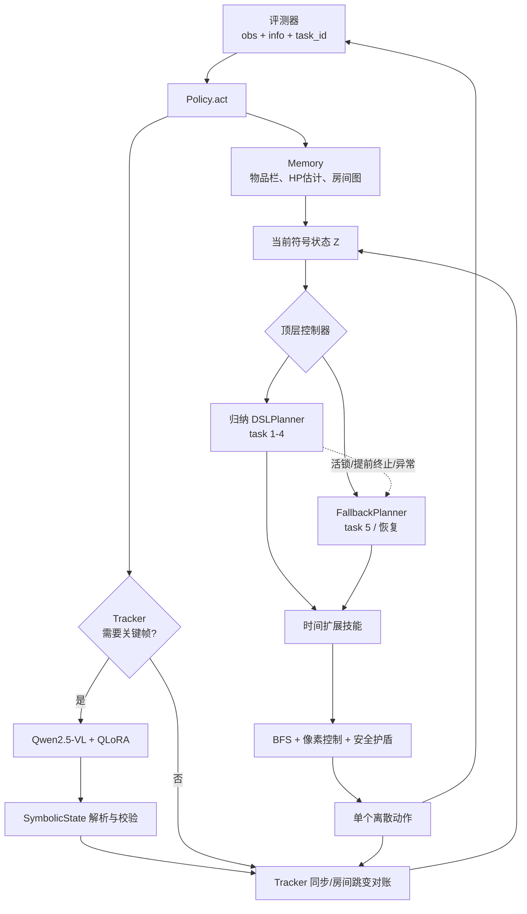
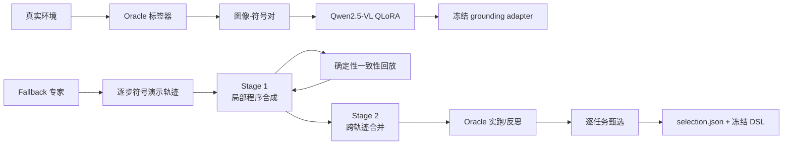

# NSI Agent 详细设计报告

> 仓库：NesyLink / Mathematical Logic Project  
> 设计对象：`nsi_agent/` 及其提交入口、训练产物和环境集成
> 报告日期：2026-07-15

## 1. 报告范围与结论

`nsi_agent` 是一个面向像素观测迷宫任务的神经符号智能体。它不是“视觉模型直接输出动作”，而是把感知、状态估计、任务规划和动作执行拆成四层：

1. Qwen2.5-VL-3B + QLoRA 将关键帧转换为紧凑符号状态；
2. `Tracker` 在关键帧之间用确定性运动模型推演玩家位置，并扩大怪物位置的不确定区域；
3. 归纳 DSL 程序或手写 `FallbackPlanner` 在符号状态上选择阶段目标；
4. 七个时间扩展技能通过 BFS、像素控制器和安全护盾产生逐步离散动作。

系统实现了 NSI 方法中的技能三元组：
$$
\pi = (\theta, \phi, G)
$$

- `θ`：技能参数，如目标格、出口方向和步数上限；
- `φ`：像素帧到 `SymbolicState` 的神经 grounding；
- `G`：由数据绑定、条件、技能调用和终止节点组成的符号执行图。

当前交付并非所有任务都使用同一种顶层程序：`selection.json` 指定 task 1–4 使用逐任务归纳程序，task 5 使用手写修正规划器。归纳程序还内置活锁检测，必要时把控制权交给修正规划器。因此，准确的系统定位是：**归纳程序主导、修正规划器兜底、符号技能统一执行的混合式神经符号 Agent**。

## 2. 设计背景与约束

### 2.1 环境约束

Agent 面向 NesyLink 的五个数理逻辑任务。环境关键约束如下：

| 约束 | 当前设计的响应 |
|---|---|
| 观测是 160×128 RGB 像素帧 | 视觉模型输出 10×8 网格与像素级实体字段 |
| 每次移动仅 1 像素 | 技能按 env step 输出一个动作，不能只做 tile 级开环控制 |
| 每局 500–2000 步 | 仅在关键帧调用 VLM，其余步骤做符号推演 |
| 玩家和怪物是 16×16 像素实体 | Tracker 使用像素坐标和 AABB 阻挡模型 |
| 怪物会移动 | 以 0.5px/步扩大不确定区域，并用安全护盾拦截危险移动 |
| 多房间地图但推理时不能读地图真值 | 通过自身穿门历史建立以 `(0,0)` 为原点的房间坐标图 |
| 最终策略只能使用像素、结构化 reward 历史和显式物品栏 | Oracle 仅用于训练、标注、录轨迹和调试，提交入口拒绝 Oracle 模式 |
| 测评可能改变布局和物体位置 | 规划以感知状态查询和 BFS 为主，任务 ID 只影响探索方向提示和 task 5 资源策略 |

任务的默认最大步数来自 `nesylink/tasks/task_config/mathematical_logic.yaml`：task 1/2 为 500，task 3 为 1500，task 4/5 为 2000。

### 2.2 输入输出契约

提交入口是 `submission_agent.py`，它导出 `Policy` 和 `make_policy`。评测器调用：

```python
policy.reset(seed=seed, task_id=task_id)
action = policy.act(obs, info)
```

输出动作必须属于整数 `0..6`：

| ID | 动作 |
|---:|---|
| 0 | WAIT/NOOP |
| 1 | UP |
| 2 | DOWN |
| 3 | LEFT |
| 4 | RIGHT |
| 5 | BUTTON_A，交互或用剑 |
| 6 | BUTTON_B，用盾 |

推理路径实际读取：

- `obs`：VLM grounding 的唯一世界视觉来源；
- `info["inventory"]`：钥匙、金币、工具和装备；
- `info["reward"]["reward_signals"]` 与 `reward_weights`：撞墙、受伤、回血和按钮确认；
- `task_id`：工件选择、探索提示以及 task 5 阶段策略。

代码不读取 `info["agent"]`、房间 ID、真实地图、对象坐标等隐藏状态。需要注意，当前实现依赖的是 **结构化 reward 明细**，不只是一个标量 reward；这是部署契约和合规审查时应显式确认的边界。

## 3. 总体架构



### 3.1 模块边界

| 模块 | 责任 | 不承担的责任 |
|---|---|---|
| `agent.py` | 生命周期、Perceive–Think–Act 编排、总兜底 | 不包含具体任务策略 |
| `grounding/` | 像素到符号状态、数据生成、训练和评估 | 不决定动作 |
| `grounding/schema.py` | 符号状态类型、文本协议、基本谓词 | 不保存跨房历史 |
| `memory.py` | 跨步/跨房状态、行为闩锁、物品栏和 HP 估计 | 不执行路径搜索 |
| `tracker.py` | 关键帧调度、运动推演、房间跳变、怪物不确定性 | 不选择任务目标 |
| `graph.py` | 通用符号执行图和可续算解释器 | 不理解具体 DSL 文本 |
| `induction/dsl.py` | DSL 校验、编译、运行、活锁恢复、工件加载 | 不训练 VLM |
| `skills.py` | BFS 导航、交互、过门、战斗、安全护盾 | 不决定全局任务顺序 |
| `planner.py` | 手写目标仲裁、跨房路由、task 5 资源规划 | 不直接实现像素移动 |
| `induction/*.py` | 轨迹录制、程序合成、合并、反思和甄选 | 最终推理不调用外部 LLM |
| `induction/artifacts/` | 冻结的可执行程序和选择配置 | 不包含模型权重 |

## 4. 在线执行详细设计

### 4.1 生命周期

`Policy.__init__` 创建 `Memory`、`Tracker`、执行上下文 `Ctx` 和默认规划器。VLM 使用延迟加载，第一次真正 grounding 时才导入深度学习依赖并加载模型。

`Policy.reset` 完成：

1. 清空房间记忆和物品栏视图；
2. 重置 Tracker，强制下一步感知；
3. 按 `task_id` 和 `selection.json` 重新加载顶层规划器；
4. 清空 DSL 共享变量作用域；
5. 忽略 seed，因为当前策略逻辑是确定性的。

`Policy.act` 的顺序具有语义意义：

```text
1. 用上一 env.step 的 info 更新物品栏、HP 和事件计数
2. 从 reward 明细识别上一动作是否撞墙，必要时回滚 1px 预测
3. 若到关键帧，则执行 VLM grounding 并与预测状态同步
4. 由 DSLPlanner 或 FallbackPlanner 产生一个动作
5. 在动作真正交给环境前，先用同一动作更新 Tracker 的预测状态
6. 返回 int action
```

这里的 reward 和画面都具有一步历史语义：`act` 看到的是上一动作执行后的新观测和反馈。

### 4.2 感知层 φ

#### 4.2.1 符号输出协议

`SymbolicState` 包含：

```text
GRID
<8 行，每行 10 个 tile 字符>
PLAYER <x>,<y> <facing>
MONSTERS <kind>:<x>,<y> ...
EXITS N:<state> S:<state> W:<state> E:<state>
```

网格描述静态和交互对象，玩家与怪物单独保留像素级左上角坐标。主要 tile 类别包括地面、墙、五类关闭宝箱、打开宝箱、尖刺、深渊、缺口、桥、按钮、拉杆和 NPC；出口状态为 `- / normal / locked / conditional / open`。

`from_text` 不是严格字符串解析器，而是容错解析器：

- 坐标被钳制在合法像素范围；
- 非法朝向回退到 `down`；
- 只接受白名单怪物类型和 tile 字符；
- 行过长会截断，短行会补齐；
- 均匀行会用自身字符补齐，避免模型缩写整行桥或深渊时用地板误补；
- 网格不是恰好 8 行则抛出 `ValueError`。

#### 4.2.2 图像预处理与推理

原图通过最近邻放大 3.5 倍到 560×448。Qwen2.5-VL 合并视觉 patch 为 28px，放大后每个原始 16px tile 对应 56px，即 2×2 个视觉 token。这是把模型感受野与游戏网格对齐的关键归纳偏置。

模型默认：

- 基座：Qwen2.5-VL-3B-Instruct；
- 精度：bfloat16；
- 可选 4-bit NF4 双量化；
- 可选 PEFT LoRA adapter；
- 贪心生成，最多 220 个新 token；
- 首次解析失败后用 `temperature=0.3` 重试一次。

若两次都失败，异常传播到 `Policy`。`Policy` 不终止 episode，而是保持符号推演，设置 3 步退避后再尝试感知。

### 4.3 符号状态 Z 与记忆

#### 4.3.1 当前房状态

`SymbolicState` 是不可变快照，提供 `player_tile`、`tiles_of`、`closed_chests`、`is_blocking`、`is_hazard`、`exit_state` 等纯查询。阻挡格与危险格刻意分开：危险格通常可走，但规划默认避开。

#### 4.3.2 跨房间记忆

`Memory` 以自身里程计坐标维护房间图：起点为 `(0,0)`，向北/南/西/东穿门分别改变 `(0,-1)/(0,1)/(-1,0)/(1,0)`。每个 `RoomMemory` 保存：

- 最近一次 grounded 房间状态；
- 有 300 步 TTL 的碰撞推断阻挡格；
- 已访问出口、已盲探方向和失败出口计数；
- 已打开出口、宝箱、按钮等行为确认事实；
- NPC 交互与拉杆次数。

`opened_exits`、`opened_chests` 和 `pressed_buttons` 是重要的**行为闩锁**：当视觉持续误读不可逆状态时，引擎通过真实动作结果确认的事实优先于后续像素分类。该设计防止已开门被反复当作锁门、已开箱被反复路由、被玩家遮挡的按钮被重复踩踏。

#### 4.3.3 物品栏与生命值

`InventoryView` 从显式接口读取钥匙、金币、物品、工具和 A/B 槽装备，并派生 `has_sword`、`has_shield`。

HP 不从隐藏 agent 状态读取，而是从 `hp_loss`、`agent_healed` reward signal 累计估计；若 task 5 环境不提供 HP signal，则按每 200 步损失 1HP 的机制回退估计。该估计用于 task 5 阶段决策和活锁阈值。

### 4.4 Tracker：稀疏感知与形式化推演

#### 4.4.1 关键帧策略

以下情况触发感知：

- episode 起始或显式 `request_perceive`；
- 正在验证出口穿越；
- 按 A/B 后，因为世界或战斗状态可能改变；
- 平静状态距离上次同步 24 步；
- 怪物进入危险邻域后距离上次同步 8 步；
- 战斗技能额外把同步间隔收紧到约 6 步。

#### 4.4.2 玩家运动模型

对移动动作，Tracker：

1. 更新 facing；
2. 按方向移动 1px；
3. 将坐标钳制在 `[0,144] × [0,112]`；
4. 计算移动后 16×16 矩形覆盖的 tile；
5. 任一 tile 被记忆判为阻挡则保持原位。

如果下一步 reward 表明 `invalid_action`，Tracker 将乐观预测回滚到上一个像素位置，并设置 `last_move_blocked` 供导航技能累计撞墙证据。

#### 4.4.3 怪物不确定性和安全护盾

每个关键帧将怪物位置重置为精确观测；此后每步把每只怪物的不确定半径增加 0.5px。`monster_clearance_px` 使用切比雪夫距离计算玩家矩形与膨胀怪物矩形的最小间隙。

`shielded(action)` 在执行移动前检查下一像素位置：

- 安全则保留原动作；
- 不安全则请求立即感知；
- 有盾时改为 `BUTTON_B`，否则改为 WAIT。

该保证是条件安全：只有在 grounding 给出的怪物集合完整、0.5px/步上界成立、Tracker 未漏掉房间跳变时，不确定区域才覆盖真实怪物位置。

#### 4.4.4 房间跳变对账

`UseExit` 通常先设置 `expect_transition`，下一关键帧再判断是否成功穿房。成功证据包括：

- 玩家像素位置发生大于 2 tile 的跳变；
- 新旧网格至少 12 个 tile 不同；
- 落点位于运动方向相反侧的入口边界。

环境可能在 `UseExit` 正式设置标志前，就因玩家贴边对齐而立即传送。Tracker 因此还实现“计划外穿房”检测，使用最后移动方向、网格大换和对侧落点登记房间坐标，避免把新房快照写进旧房记忆。

### 4.5 图执行引擎 G

`graph.py` 定义五类节点：

| 节点 | 语义 |
|---|---|
| `DataOp` | 从符号状态计算值并写入共享 scope |
| `CheckOp` | 对谓词求值，选择 true/false 边；回边表示循环 |
| `PrimitiveOp` | 直接产生一个环境动作；当前归纳 DSL 未暴露此节点 |
| `SkillOp` | 创建并持续执行一个时间扩展技能，按成功/失败分支 |
| `TerminalOp` | 结束程序并返回成功标志和符号诊断 |

`Interpreter.step` 是可续算小步解释器。单次调用持续经过不产出动作的节点，直到：

- 产生恰好一个动作；
- 技能或程序终止；
- 连续经过 256 次非产出转移，返回 `nonproductive_loop`。

`SkillProgram.__post_init__` 静态检查入口和所有边都指向存在节点。解释器在给定程序、scope 与符号状态时完全确定。

### 4.6 DSL 设计与安全边界

归纳程序以 JSON 保存，支持 `data/check/skill/terminal` 节点以及每步优先检查的 `reactive` 守卫。表达式使用受限 Python AST：

- 允许布尔、比较、有限算术、常量、列表/元组、下标、三元式和普通函数调用；
- 属性访问只允许 `inv.*` 与 `var.*`；
- `eval` 的 builtins 为空；
- 函数命名空间只包含纯查询，如 `closed_chests`、`nearest`、`reachable`、`exit_state`、`threatened`、`hop_toward` 等。

编译器会容忍 LLM 常见结构噪声：修复边字段别名，为悬空边生成自动终止节点，入口无效时改用首节点。结构可修复并不等于程序可接受，最终仍由轨迹一致性和实跑验证把关。

`hop_toward(kind)` 在已知房间图上做 BFS，返回去往最近锁门、宝箱、拉杆或未探索区域的首跳方向，使 DSL 不必硬编码多房坐标。

### 4.7 原语技能层

所有技能实现统一协议：

```python
reset(ctx, **args)
step(ctx) -> ("act", action) | ("ok", detail) | ("fail", diagnosis)
```

#### 4.7.1 公共导航

`bfs_path` 在 10×8 网格上每步重规划，复杂度上界可视为 `O(V+E)`，其中 `V≤80`、`E≤4V`。默认约束：

- 不越界；
- 不进入阻挡或 hazard；
- 避开怪物不确定区域；
- 可额外避开指定出口 tile。

首次找不到路径时会忽略怪物区域重试一次，但逐像素安全护盾仍然生效；第二次仍失败才返回 `no_path`。

`move_toward_waypoint` 先修正误差较小的轴，再沿主轴前进，避免 16×16 矩形斜切进路径外阻挡格。交互前使用 `disambiguation_nudge` 将玩家中心从 tile 边界歧义区推向当前格内部。

#### 4.7.2 七个技能

| 技能 | 设计要点 | 主要失败诊断 |
|---|---|---|
| `goto` | BFS + 像素对齐；连续关键帧停滞或四次撞墙后学习临时阻挡格 | `timeout`、`no_approach`、`no_path` |
| `open_chest` | 到宝箱邻格、关键帧确认、按 A、验证变为打开状态 | `not_a_chest`、`chest_unreachable`、`chest_not_opening` |
| `press_button` | 站到按钮格；优先用 reward 事件确认，解决玩家遮挡按钮像素的问题 | `button_unreachable`、`button_not_pressing` |
| `toggle_switch` | 到邻格按 A；远端桥变化无法本房验证，因此操作后重感知并由规划器重查可达性 | `switch_unreachable`、`timeout` |
| `use_exit` | 选择出口 tile、精确贴边、向外推、下一关键帧对账；路径避开其他出口 | `exit_tiles_blocked`、`exit_unreachable`、`exit_blocked`、`crossed_other_exit` |
| `kill_monster` | 选择最近怪、轴对齐、在剑击窗口挥剑、利用 60 tick 眩晕追击，撞障碍时提交 10 步 BFS 绕行 | `no_sword`、`timeout` |
| `wait` | 输出指定步数 NOOP | 无特殊诊断 |

战斗窗口允许目标与玩家在主轴上相距约 4–30px、横轴误差不超过 10px。引擎先结算剑再结算接触，命中后怪物眩晕，因此可在较近距离挥剑。无挥剑窗口且接触将发生时，技能优先举盾。

### 4.8 顶层控制器

#### 4.8.1 归纳 DSLPlanner

当前 `selection.json`：

| 任务 | 顶层控制器 | 工件 |
|---|---|---|
| task 1 | local DSL | `mathematical_logic_task_1.json`，8 节点 |
| task 2 | local DSL | `mathematical_logic_task_2.json`，7 节点 + 1 guard |
| task 3 | local DSL | `mathematical_logic_task_3.json`，13 节点 + 1 guard |
| task 4 | local DSL | `mathematical_logic_task_4.json`，14 节点 |
| task 5 | fallback | 无 DSL 工件 |

DSLPlanner 的优先级为：恢复规划器 > 已触发 reactive 技能 > 新 reactive 守卫 > 主解释器。

它用进展 marker 检测活锁。marker 包含钥匙、金币、工具、已知房数、剩余宝箱、剩余怪物和已压按钮数。150 步无变化进入恢复；估计 HP≤3 时缩短为 80 步。恢复最多运行 500 步。`MAX_RECOVERIES=1` 的当前语义是：第一次启动恢复后 `recoveries >= 1`，恢复规划器会永久持有控制权，而不是恢复一次后再交回主程序。

如果归纳程序返回 success 但 episode 尚未结束，系统把它视为覆盖缺口并立即启动恢复。如果程序运行异常，则转换为 `runtime_error` 诊断并输出 WAIT，避免测评器崩溃。

#### 4.8.2 FallbackPlanner

修正规划器将长期任务拆成 `Goal(key, skill, args)`。同一时刻只驱动一个技能；技能完成后重新仲裁。失败目标写入诊断并冷却 120 步，防止立即重复失败。钥匙增加、拉杆切换等能力或连通性变化会清除相关限制并允许重试。

一般目标优先级可概括为：

1. 无剑且受威胁时逃跑；
2. 有剑且怪物近或阻路时战斗；
3. 执行已提交的拉杆恢复意图；
4. 有钥匙时处理锁门；
5. 开最近可达且未确认打开的宝箱；
6. 踩未确认按钮；
7. 尝试条件门；
8. 目标不可达且存在拉杆时切换连通性；
9. 在房间图上路由到待办房或前沿房；
10. 对视觉可能漏掉的出口做盲探；
11. 必要时切换桥方向后再探被 hazard 覆盖的边界；
12. 无目标时等待并周期重感知。

跨房路径使用房间图 BFS 求首跳，不依赖真实地图 ID。对感知为 `-`、但边界 tile 看起来可通行的方向，规划器可以调用 `use_exit` 让环境裁决门是否存在；失败方向写入 `probed_dirs`，获取新钥匙后会清空并重探，因为锁门能力已经改变。

#### 4.8.3 task 5 阶段机

task 5 由于周期掉血和任务链更长，FallbackPlanner 使用四阶段资源策略：

```text
NEED_KEY -> HAVE_KEY -> NEED_HEAL -> CLEANUP
```

- `NEED_KEY`：寻找 key/unknown 宝箱和有价值的前沿；
- `HAVE_KEY`：以锁门逃生和最小必要 detour 为高优先级；
- `NEED_HEAL`：门已打开后优先路由到已发现的治疗宝箱；
- `CLEANUP`：完成剩余宝箱、按钮、条件门和房间待办。

阶段变化由钥匙数量、历史持钥匙事实、视觉中的 open 出口、已知治疗房和 HP/步数压力共同驱动。目标评分同时考虑宝箱类别、房间距离、出口状态、前沿价值和 path cost，从而在生命预算内优先完成关键资源链。

## 5. 离线学习与程序归纳



### 5.1 Grounding 数据与训练

`grounding/dataset.py` 生成任务轨迹、随机游走和大量独立随机布局，输出 PNG 与 `train.jsonl/heldout.jsonl`。标签由 Oracle 从训练环境内部生成，但只用于监督学习。

`dataset_v4.py` 针对实际错误增加：

- 已锁门打开前/后的状态翻转样本；
- 深渊覆盖、部分可见门和不可见门的标签卫生；
- 五个课程任务的运行时状态 sweep；
- 课程房对象位置 shuffle，切断“房间身份 → 固定物体位置”的记忆捷径。

训练使用 4-bit 基座 + LoRA：rank 默认 16，alpha 为 32，dropout 0.05，目标模块覆盖注意力和 MLP 投影；只对 assistant 标签计算 loss，prompt 和视觉占位 token 都 mask 为 `-100`。

评估按字段报告网格 tile 准确率、整格全对、玩家像素/格子、朝向、怪物、出口、完整状态和解析失败率。玩家像素允许 ±2px，怪物位置以 8px 粒度允许一个 bucket 的误差。

### 5.2 演示轨迹

`induction/record.py` 运行 Oracle grounding + FallbackPlanner，逐步记录：

- 房间里程计坐标；
- 动作前完整符号状态文本；
- 物品栏；
- 专家动作；
- 当前专家技能与参数；
- 环境事件。

当前五条轨迹均标记成功，长度分别为 279、197、582、1229、1069 步。

### 5.3 Stage 1：局部程序合成

每条轨迹先被压缩为决策片段，再由 GPT-4o 结构化生成 DSL。每轮流程为：编译 → 回放 → 提取首批发散点 → 将反例反馈给 LLM → 生成完整修订程序。默认最多四轮，覆盖达到 98% 且无发散时提前结束。

LLM 只负责提出候选；程序是否可执行和是否覆盖专家行为由本地确定性机制判断。

### 5.4 经验程序一致性

`replay` 在录制状态序列上执行候选程序，并比较每一步的候选动作与专家动作。匹配步数构成经验一致区域 `|R̂|`，目标函数为：

\[
\max_\pi \sum_{\tau}|\hat{R}_\tau(\pi)| - 0.5|\pi|
\]

其中复杂度 `|π|` 由节点、reactive guard 和表达式近似 token 成本组成。发生非 WAIT 发散时会重建 DSLPlanner，使后续轨迹片段仍可计分；连续超过 6 个“程序 WAIT、专家非 WAIT”也记录为发散。专家 WAIT 而程序行动被当作中性，不扣匹配也不立即记发散。

该一致性衡量的是专家状态分布上的动作复现，不能证明候选在自身诱导状态分布中闭环成功，所以后续必须进行 live rollout。

### 5.5 Stage 2：跨轨迹合并

先选择在全部轨迹上目标值最高的局部程序作为全局初始程序，再针对覆盖最低轨迹进行合并。提示允许四种算子：条件分支、模块移植、变量提升和循环折叠。

候选只有同时满足以下条件才接受：

- 总目标值严格提高；
- 任一旧轨迹的 matched 不下降超过 10 步。

当前 `global_program.json` 是 7 节点 + 1 reactive guard 的 task 2 风格程序，静态复杂度为 27。

### 5.6 反思与实跑甄选

`reflect.py` 用 Oracle 后端在真实闭环环境中运行归纳程序。失败时把终止原因、诊断、事件和最近决策日志交给 GPT-4o 嫁接恢复分支。补丁必须：

1. 编译成功；
2. 演示一致性目标不低于 baseline−25；
3. 原失败任务 live rollout 成功；
4. 若针对变体修复，还必须在基础地图上成功。

`select.py` 按 local → global → fallback 顺序逐任务实跑，选择第一个成功候选并写入 `selection.json`。最终推理严格服从该文件，不再调用 GPT-4o 或任何外部 API。

## 6. 容错与降级设计

| 故障 | 检测 | 降级策略 |
|---|---|---|
| VLM 生成格式错误 | `SymbolicState.from_text` 失败 | 温度 0.3 重试一次 |
| VLM 加载/推理持续失败 | `Policy` 捕获任意异常 | 3 步退避，继续 dead-reckoning；无初始状态时规划器 WAIT |
| 预测移动撞墙 | reward 明细匹配 step+invalid_action | 回滚 1px；连续碰撞后学习 TTL 阻挡格 |
| 视觉误读不可逆对象状态 | 行为完成但像素仍显示旧状态 | `opened_*` / `pressed_buttons` 闩锁覆盖视觉 |
| 漏检出口 | 边界 tile 可通但 exit 为 `-` | 盲探并让环境裁决；记录已探方向 |
| 误入其他出口 | Tracker 登记实际穿越方向 | `UseExit` 返回 `crossed_other_exit`，避免错误确认锁门 |
| 技能不可达或超时 | 结构化 diagnosis | 目标冷却；有拉杆时触发连通性恢复 |
| DSL 非产出循环 | 256 次内部转移上限 | 程序失败诊断 |
| DSL 活锁/提前成功 | 80/150 步进展计时或 episode 未终止 | FallbackPlanner 接管 |
| DSL 表达式异常 | 捕获运行时异常 | 记录 `runtime_error` 并 WAIT |
| 顶层规划器未知异常 | `Policy.act` 总兜底 | 返回 WAIT，保证评测器继续运行 |

总兜底提高了可用性，但也会隐藏程序错误。生产诊断应保留异常计数或日志；当前提交路径为了不影响评测，仅静默降级。

## 7. 配置、依赖与部署

### 7.1 环境变量

| 变量 | 含义 | 默认值/行为 |
|---|---|---|
| `NSI_VLM_MODEL` | Qwen2.5-VL 基座或合并模型目录 | `/root/autodl-tmp/models/Qwen2.5-VL-3B-Instruct` |
| `NSI_VLM_ADAPTER` | 可选 LoRA adapter 目录 | 空 |
| `NSI_VLM_4BIT` | 是否 4-bit 加载 | `1` |
| `NSI_BACKEND` | 提交入口后端 | 默认 `vlm`；设为 `oracle` 会抛错 |

### 7.2 运行时依赖

符号层只需 Python 标准库和 NumPy；VLM 推理实际还需要 PyTorch、Transformers、Pillow，以及在相应配置下的 PEFT、bitsandbytes 和 CUDA。

当前 `pyproject.toml` 只声明 NesyLink 环境的 `gymnasium/numpy/PyYAML`，包发现也只包含 `nesylink*`。因此：

- `pip install -e .` 在源码仓运行时可以 import `nsi_agent`，但构建 wheel 时不会打包 `nsi_agent`；
- VLM、训练和归纳依赖没有可安装的 optional extra；
- 默认模型路径和 `device_map="cuda:0"` 绑定云端 Linux/CUDA 环境。

正式分发前应增加 `nsi_agent*` 包发现、推理/训练 extras、模型启动自检和可配置 device/dtype。

## 8. 可验证性与 Lean 对接

神经网络正确性不在 Lean 证明范围内；可证明边界从 `SymbolicState` 输出开始。Python 与现有 Lean 模块的主要对应关系为：

| Python 设计 | Lean 对接模块 | 可证明性质 |
|---|---|---|
| 网格、阻挡、hazard | `EnvFormalization.lean`、`GridBfs.lean` | 合法移动不越界、不进墙；路径节点合法 |
| `bfs_path` 两阶段搜索 | `GridBfs.lean`、`GoToTile.lean` | soundness、无重复、避障/避 hazard；带约束完备性前提 |
| 怪物不确定区域与 shield | `MonsterDanger.lean`、`SafetyShield.lean` | 在 tracker 区域覆盖真实怪物的前提下，过滤动作安全 |
| 技能前后置条件 | `SkillContracts.lean`、`Composition.lean` | 导航与开箱/按钮等技能组合契约 |
| 图解释器与 reactive guard | `DSLExecution.lean` | 单步有界、动作产出和控制模式性质 |
| Planner 目标优先级 | `HighPlanner.lean`、`GenericPlanner.lean` | 威胁时逃跑/战斗、恢复选择等局部性质 |
| DSL→shield→环境组合 | `IntegratedExecution.lean`、`WorldDSL.lean` | 分层执行与环境小步关系 |
| 五关抽象执行 | `Task1.lean` ... `Task5.lean` | 有预算的符号执行 witness |

需要诚实保留三个证明假设：视觉 grounding 与真实状态的一致性、Tracker 怪物区域的覆盖性、Lean tile 级抽象与 Python 像素 AABB 语义的细化关系。否则不能从符号层定理直接推出真实像素环境的无条件端到端安全。

## 9. 性能与复杂度

### 9.1 在线成本

- VLM grounding 是主计算瓶颈；关键帧调度把调用频率从每步一次降低到平静约每 24 步、危险约每 8 步、战斗约每 6 步。
- 每步 tile BFS 最多访问 80 个节点，相比 VLM 成本可忽略。
- 图解释器每次 env step 内最多 256 次无动作节点转移，避免 CPU 忙循环。
- Memory 与房间图的空间随已探索房间数线性增长；单房网格固定为 80 tile。

### 9.2 仓库记录的效果

`REPORT.md` 记录当前最终配置在五个基础任务上均成功，并报告 VLM 与 Oracle 路径步数一致；`test_generalization/test2_report.md` 记录了不同版本和变体上的演进过程。这些数字是仓库内已有实验记录，并非本次审阅环境复测。

本次静态审阅实际确认：

- `selection.json` 的 task 1–4/local、task 5/fallback 配置与加载代码一致；
- 11 个非 selection JSON 工件均可由当前 DSL 编译器成功编译；
- 当前五条演示轨迹均标记成功，长度为 279/197/582/1229/1069；
- 当前环境缺少 `pytest` 和 `gymnasium`，未能在本次审阅中重跑单测或 Oracle rollout。

## 10. 测试设计与建议门禁

仓库目前只有 `tests/test_agent_play.py`，主要覆盖观察器辅助函数和调试属性契约；核心 Agent 的单元测试覆盖明显不足。建议把以下门禁纳入 CI：

1. **Schema 属性测试**：`to_text/from_text` round-trip、非法行、坐标钳制和均匀行补齐；
2. **Tracker 小步测试**：边界钳制、AABB 阻挡、reward 回滚、计划内/计划外穿房和 trap respawn 区分；
3. **BFS/技能测试**：最短路、hazard、monster avoid、交互边界、不同出口劫持；
4. **DSL 安全测试**：恶意 AST、悬空边修复、非产出环、guard 抢占和异常降级；
5. **Artifact contract**：所有工件编译、`selection.json` 引用存在、节点/技能参数类型正确；
6. **Replay 回归**：固定每个工件在五条 trace 上的 coverage 与复杂度下界；
7. **Oracle 端到端**：五任务 × 多 seed，selected/fallback 两套控制器；
8. **VLM held-out**：解析失败率、grid exact、exit/player/monster 指标阈值；
9. **像素端到端**：基础任务与 object/layout/topology 变体，记录成功率、步数和恢复次数；
10. **Lean 门禁**：`cd lean && lake build`，并检查无 `sorry/admit`。

## 11. 风险与技术债

### 11.1 高优先级

1. **打包与依赖不完整**：`nsi_agent` 不在 setuptools 包发现中，VLM 依赖未声明；源码外部署容易失败。
2. **reward 契约表述不准确**：注释称“reward value alone”，实现实际读取结构化 signals/weights。若最终接口只保留标量 reward，撞墙、HP 和按钮确认能力都会退化。
3. **默认部署强绑定 CUDA 路径**：硬编码 `/root/...`、`cuda:0` 和 bfloat16，没有 CPU/MPS/多 GPU 自动选择或清晰启动错误。
4. **异常被静默吞掉**：工件加载、VLM、规划器异常都可回退，虽然不崩溃，但会让配置错误表现为长时间 WAIT，难以定位。
5. **核心逻辑缺少自动化测试**：Tracker、技能、DSL、FallbackPlanner 和 selection 都没有直接单元测试。

### 11.2 中优先级

1. `FallbackPlanner` 超过 1500 行，通用目标仲裁和 task 5 阶段/评分混在一个类中，建议拆成通用仲裁器、房间路由器、task profile 和资源策略。
2. DSL 的“进展 marker”在注释中称单调，但“已知房数增加”和感知快照中的剩余对象计数可增可减，也会受 VLM 误差影响；应改为行为确认的累计事件或显式偏序。
3. `MAX_RECOVERIES=1` 与注释“then corrective planner keeps control”一致，但容易被误解为“恢复一次后交还”。建议把配置名改为 `PERMANENT_AFTER_RECOVERIES` 或显式状态枚举。
4. `Memory.on_step` 与 `OpenChest` 都可能对治疗事件调用 `note_heal`；虽然有最大 HP 钳制，但会造成 HP 估计偏高，应统一以 reward 事件或行为闩锁为单一事实源。
5. 行为闩锁没有工件版本和环境版本绑定；地图机制改变后，不可逆假设可能不再成立。
6. 工件 schema 只限制 `target/direction`，而原生技能还支持 `max_steps/adjacent/align/steps` 等参数；DSL 表达力和技能接口并非完整对齐。

### 11.3 方法边界

- 轨迹一致性只在专家状态序列上评估，不能替代闭环成功率；仓库已通过 live rollout 和运行时恢复缓解，但没有形式化闭环完备性保证。
- 盲探和 reward 对账是有效的主动感知，但也意味着系统不完全由静态 VLM 状态驱动；设计文档和合规说明必须把它们视为正式输入通道。
- task ID 对 task 5 阶段策略有实质影响，不只是探索方向提示；因此系统不是完全任务无关的单一程序。
- 安全护盾会在无盾时 WAIT，若感知长期失败，怪物不确定区域持续膨胀可能导致永久停滞；需要恢复感知或区域衰减策略。

## 12. 推荐演进路线

### 第一阶段：可部署与可观测

1. 补全包发现和 `agent-inference` / `agent-train` extras；
2. 增加 `Policy.healthcheck()`，启动时校验模型、adapter、device、工件和 selection；
3. 将捕获异常转换为有界诊断计数，并在调试模式输出；
4. 固化结构化 reward 的正式接口，或改造 `Policy.act` 显式接收上一标量 reward。

### 第二阶段：可测试与可维护

1. 为 schema、tracker、skills、DSL 和 artifact loader 建立单元/属性测试；
2. 拆分 `FallbackPlanner`，将 task 5 逻辑配置化；
3. 用行为事件构造真正单调的 progress ledger；
4. 为行为闩锁增加来源、时间和环境版本元数据。

### 第三阶段：提升归纳闭环能力

1. 在一致性目标之外加入 live rollout 成功、步数和恢复次数；
2. 扩充 DSL 的资源/阶段原语，但保持 AST 与查询命名空间白名单；
3. 对地图变体使用 curriculum，并按基础图不回退约束进行选择；
4. 将 selection 从“第一个成功”升级为多 seed、多变体下的多目标排名。

## 13. 复现与审阅命令

```bash
# 静态测试（安装 dev 依赖后）
python -m pytest -q

# Oracle 符号层端到端
python -m nsi_agent.debug_run --episodes 3
python -m nsi_agent.debug_run --episodes 3 --fallback

# 最终像素策略
export NSI_VLM_MODEL=<model-dir>
export NSI_VLM_ADAPTER=<adapter-dir>   # 合并模型可省略
python utils/evaluate_policy.py --policy submission_agent.py --num-envs 10

# Grounding 评估
python -m nsi_agent.grounding.eval_grounding \
  --data <dataset> --split heldout \
  --model <model-dir> --adapter <adapter-dir>

# 重新归纳和甄选
python -m nsi_agent.induction.record
python -m nsi_agent.induction.synthesize
python -m nsi_agent.induction.consolidate
python -m nsi_agent.induction.select

# Lean 验证
cd lean && lake build
```

## 14. 关键源码索引

| 主题 | 文件 |
|---|---|
| 提交入口 | `submission_agent.py` |
| 在线主循环 | `nsi_agent/agent.py` |
| 动作与几何常量 | `nsi_agent/constants.py` |
| 符号状态协议 | `nsi_agent/grounding/schema.py` |
| VLM 推理 | `nsi_agent/grounding/vlm.py` |
| 训练与评估 | `nsi_agent/grounding/train_qlora.py`, `eval_grounding.py` |
| 训练数据 | `nsi_agent/grounding/dataset.py`, `dataset_v4.py` |
| 跨房间记忆 | `nsi_agent/memory.py` |
| 关键帧与状态推演 | `nsi_agent/tracker.py` |
| 图程序解释器 | `nsi_agent/graph.py` |
| 原语技能 | `nsi_agent/skills.py` |
| 手写修正规划器 | `nsi_agent/planner.py` |
| DSL 编译与运行 | `nsi_agent/induction/dsl.py` |
| 轨迹一致性 | `nsi_agent/induction/consistency.py` |
| 两阶段归纳 | `nsi_agent/induction/synthesize.py`, `consolidate.py` |
| 反思和选择 | `nsi_agent/induction/reflect.py`, `select.py` |
| 冻结工件 | `nsi_agent/induction/artifacts/` |
| 评测入口 | `utils/evaluate_policy.py` |
| 既有实验报告 | `REPORT.md`, `test_generalization/` |

